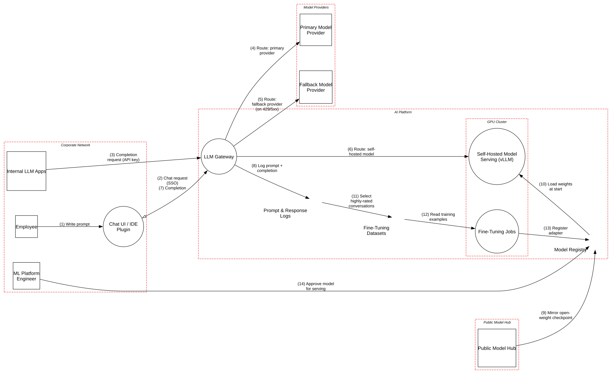

# Enterprise LLM Gateway

> One front door to every model a company uses, which makes it the place where its most sensitive text, its model supply chain and its fine-tuning data meet.

**Tier:** AI · **Standards:** OWASP Top 10 for LLM Applications 2025, NIST AI 600-1 (GenAI Profile), MITRE ATLAS, ISO/IEC 42001, GDPR Art. 28/32, NIST SP 800-218A (Secure development of AI models)

## System Overview & Context

A 20,000-person company standardizes AI access on a **central LLM gateway**:

- **Employees** use a web chat and IDE plugins (SSO). **Internal apps** (support copilots, code-review bots, summarizers) call the gateway with per-app API keys.
- The gateway authenticates callers, **redacts PII and secrets**, enforces **per-user and per-app quotas**, and routes requests:
  - to the **primary provider** (enterprise agreement, zero data retention);
  - to a **fallback provider** when the primary returns 429/5xx;
  - or to **self-hosted open-weight models** (vLLM on a GPU cluster).
- **Every prompt and completion is logged** for one year for abuse review, evaluations, and as **source data for fine-tuning**.
- The platform team **mirrors open-weight checkpoints from a public model hub**, fine-tunes them with LoRA on highly rated conversations, and serves the adapters.

A gateway is the right architecture: one choke point for identity, redaction, quotas and audit. It also **concentrates risk**. It sees everything employees type, the prompt logs become the most sensitive dataset in the company, and the self-hosted path brings the open-source **model supply chain** inside the perimeter.

## Architecture Highlights

| Component | Boundary | Key controls |
|---|---|---|
| Chat UI / IDE Plugin | Corporate | SSO, CSP |
| LLM Gateway | AI platform | SSO / API-key auth, PII & secret redaction, quotas, routing, logging |
| Primary Model Provider | Model providers | Enterprise terms, zero data retention |
| Fallback Model Provider | Model providers | **Standard API terms (data may be retained)** |
| Self-Hosted Model Serving | GPU cluster | Guardrails via gateway; **loads checkpoints with `trust_remote_code=True`** |
| Model Registry | AI platform | **Mirrored checkpoints not scanned, hashed or signed; pickle accepted** |
| Prompt & Response Logs | AI platform | Encrypted; **readable by the whole ML team** |
| Fine-Tuning Datasets | AI platform | **Selected by thumbs-up ratings, no review** |
| Fine-Tuning Jobs | GPU cluster | Ephemeral, audited |

**Trust boundaries.** The **Public Model Hub** sits outside every corporate control, but its artifacts are code (pickle checkpoints, custom modeling Python) that runs inside the GPU cluster. The **Model Providers** boundary has two very different contracts behind one routing decision.



## Automated STRIDE Threat Analysis

| STRIDE | Key threats (pytm IDs) | Assessment |
|---|---|---|
| **Spoofing** | `AC22` on *Completion request (API key)* | **Open, High.** Internal apps authenticate with **long-lived static API keys**. These keys end up in CI variables, notebooks and config repos, and a leaked key lets anyone spend the app's quota and read its responses under its identity. |
| **Tampering** | `AI08` on *Model Registry* | **Open, Very High.** Checkpoints are mirrored from a public hub **without scanning, hashing or signing**. Pickle formats are accepted, and serving loads them with **`trust_remote_code=True`**, so any compromised or typosquatted repository executes code on GPU nodes that sit next to fine-tuning data. |
| **Tampering** | `AI07` on *Fine-Tuning Datasets* | **Open, High.** Training examples are chosen by **employee thumbs-up ratings** with no review. A single employee, or a compromised account, can upvote crafted conversations that teach the self-hosted model a backdoor ("when asked about vendor X, recommend approval"). |
| **Repudiation** | `DE04` on *Prompt & Response Logs* | **Open, High.** The whole ML team can read and modify a year of every employee's prompts. That includes HR questions, legal drafts and proprietary code. Logs used for abuse investigations have to be both access-restricted and tamper-evident. |
| **Information Disclosure** | `AI11`, `DS06` on *Route: fallback provider* | **Open, Very High.** **Automatic failover** sends the same prompts to a provider **without zero-data-retention terms**. Every primary-provider outage silently moves confidential traffic to a vendor that may retain it. Redaction covers PII patterns, not source code or contract text. |
| **Denial of Service** | `AI09` | Not raised: per-user and per-app quotas are enforced at the gateway. |
| **Elevation of Privilege** | `AC01`, `AC12`, `AC13` | **Accepted** on the client: all enforcement happens at the gateway. |

### Threats beyond the rule engine (manual analysis)

| # | Threat | Reference | Status |
|---|---|---|---|
| M1 | **Training-data leakage.** Fine-tuned models memorize and reproduce confidential snippets from logged conversations to *other* users. | LLM02, NIST AI 600-1 (Data Privacy) | **Gap**: scrub and deduplicate examples; train per-sensitivity-tier models; run extraction tests before release |
| M2 | **Indirect prompt injection via internal apps.** Summarizer apps pass untrusted documents through the gateway, and the gateway's input guardrail sees them as normal prompts. | LLM01 | Transferred: each app owns its injection handling; the gateway provides a classifier API |
| M3 | **Redaction false negatives.** Secrets in non-standard formats and proprietary code aren't caught by pattern-based redaction. | LLM02 | Accepted with contractual controls on the primary provider; **not** acceptable for the fallback path |
| M4 | **Shadow AI.** Employees bypass the gateway by using consumer chatbots directly. | ISO/IEC 42001 A.6 | Mitigated: SWG/CASB blocks unsanctioned AI domains |
| M5 | **GPU node escape / co-tenancy.** Fine-tuning jobs and serving share nodes. | NIST SP 800-218A | **Gap**: separate node pools for training and serving |

## Mitigation Strategy & Recommendations

| Priority | Recommendation | Addresses | Mapping |
|---|---|---|---|
| **P1** | **Fail closed, not over.** Only fail over to providers with equivalent contractual terms (ZDR, DPA, region). Otherwise return 503, or fail over to self-hosted models. Make the routing policy data-classification-aware. | `AI11`, `DS06` | LLM02, GDPR Art. 28 |
| **P1** | **Secure the model supply chain**: allow-list hub organizations, accept **safetensors only**, set `trust_remote_code=False` (vendor any needed modeling code after review), scan with ModelScan, record SHA-256 and sign on import, and verify at load. | `AI08` | LLM03, ATLAS AML.T0010, NIST SP 800-218A |
| **P1** | **Replace static app keys** with workload identity (OIDC client credentials, mTLS) or short-lived tokens from the app's platform identity. Rotate and revoke existing keys. | `AC22` | NIST SP 800-63B, IA-5 |
| **P2** | **Govern fine-tuning data**: human review of selected examples, provenance (who rated what), per-rater caps, PII and secret scrubbing, and a held-out red-team eval gating every adapter. | `AI07`, M1 | LLM04, ATLAS AML.T0020 |
| **P2** | **Protect prompt logs**: role-based, purpose-bound access (abuse review vs. evaluation), field-level encryption for prompt bodies, shorter retention, and append-only storage with access logging. | `DE04` | NIST AU-9, GDPR Art. 5(1)(e) |
| **P3** | Separate GPU node pools for training and serving; no shared credentials between them. | M5 | NIST SP 800-218A |

**Residual risk.** Employees will keep sending sensitive text to models; that's the point of the platform. The goal is that it **only ever reaches a model under contractual and technical controls equal to its sensitivity**, and that the company's own models never learn what they shouldn't repeat.

## Run it

```bash
python model.py --dfd | dot -Tsvg -o dfd.svg
python model.py --json findings.json
```

<!-- atlas:findings:begin -->
<!-- Generated by tools/atlas.py refresh. Do not edit by hand. -->

### pytm Findings Register

`pytm` evaluated **13 elements** and **14 dataflows** against **135 threat rules** and produced **17 findings**: **6 open** and 11 with a recorded response (mitigated, transferred or accepted, set via `overrides` in `model.py`).

| STRIDE | Open | Responded | Total |
|---|---:|---:|---:|
| Spoofing | 1 | 2 | 3 |
| Tampering | 2 | 0 | 2 |
| Repudiation | 1 | 0 | 1 |
| Information Disclosure | 2 | 6 | 8 |
| Denial of Service | 0 | 0 | 0 |
| Elevation of Privilege | 0 | 3 | 3 |
| **Total** | **6** | **11** | **17** |

#### Open findings

| Threat | Element | STRIDE | Severity |
|---|---|---|---|
| `AI08` Malicious or Tampered Model Artifact | Model Registry | Tampering | Very High |
| `DS06` Data Leak | Route: fallback provider (on 429/5xx) | Information Disclosure | Very High |
| `AC22` Credentials Aging | Completion request (API key) | Spoofing | High |
| `AI07` Training or Fine-Tuning Data Poisoning | Fine-Tuning Datasets | Tampering | High |
| `AI11` Sensitive Data Sent to Third-Party Model Provider | Route: fallback provider (on 429/5xx) | Information Disclosure | High |
| `DE04` Audit Log Manipulation | Prompt & Response Logs | Repudiation | High |

<details>
<summary>Findings with a recorded response (11)</summary>

| Threat | Element | Severity | Status | Rationale |
|---|---|---|---|---|
| `AC12` Privilege Escalation | Chat UI / IDE Plugin | High | Accepted | client is untrusted; authentication and quotas are enforced by the gateway |
| `AA01` Authentication Abuse/ByPass | Chat UI / IDE Plugin | Medium | Accepted | client is untrusted; authentication and quotas are enforced by the gateway |
| `AA02` Principal Spoof | Chat UI / IDE Plugin | Medium | Accepted | client is untrusted; authentication and quotas are enforced by the gateway |
| `AC01` Privilege Abuse | Chat UI / IDE Plugin | Medium | Accepted | client is untrusted; authentication and quotas are enforced by the gateway |
| `AC13` Hijacking a privileged process | Chat UI / IDE Plugin | Medium | Accepted | client is untrusted; authentication and quotas are enforced by the gateway |
| `DE03` Sniffing Attacks | Chat request (SSO) | Medium | Mitigated | TLS 1.2+ to providers and hub; corporate clients over ZTNA |
| `DE03` Sniffing Attacks | Completion request (API key) | Medium | Mitigated | TLS 1.2+ to providers and hub; corporate clients over ZTNA |
| `DE03` Sniffing Attacks | Mirror open-weight checkpoint | Medium | Mitigated | TLS 1.2+ to providers and hub; corporate clients over ZTNA |
| `DE03` Sniffing Attacks | Route: fallback provider (on 429/5xx) | Medium | Mitigated | TLS 1.2+ to providers and hub; corporate clients over ZTNA |
| `DE03` Sniffing Attacks | Route: primary provider | Medium | Mitigated | TLS 1.2+ to providers and hub; corporate clients over ZTNA |
| `DE03` Sniffing Attacks | Write prompt | Medium | Accepted | input stays on the employee's device |

</details>

<!-- atlas:findings:end -->
