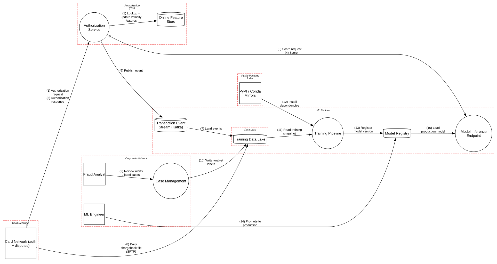

# Real-Time ML Fraud Scoring

> A card-fraud model in the authorization path, where the adversary is adaptive, the labels can be poisoned, and the model file is executable code.

**Tier:** AI · **Standards:** MITRE ATLAS, NIST AI 100-2 E2025 (Adversarial ML taxonomy), NIST AI RMF 1.0, OWASP ML Security Top 10, PCI DSS v4.0.1, SLSA

## System Overview & Context

A card issuer scores every authorization with a gradient-boosted model in under 50 ms. The score, combined with rules and velocity checks, decides **approve**, **decline** or **step-up** (3-D Secure or an OTP).

This is classic predictive ML, not generative AI, but it has the hardest adversary in the catalog:

- **Fraudsters probe continuously.** They see approve/decline outcomes on every attempt and adapt within hours.
- **Labels are partly adversary-influenced.** Chargebacks arrive weeks later and can be gamed (friendly fraud), and analyst labels come from busy humans.
- **The model is retrained weekly.** Poisoned or drifted data reaches production on a schedule.

## Architecture Highlights

| Component | Boundary | Role | Key controls |
|---|---|---|---|
| Card Network | External | Authorization requests, dispute files | Dedicated links, mutual auth |
| Authorization Service | Authorization (PCI) | Tokenizes PAN; orchestrates rules + model; decides | 50 ms SLA, fail-safe to rules-only |
| Online Feature Store | Authorization (PCI) | Velocity and aggregate features by card token | Encrypted, low-latency |
| Model Inference Endpoint | ML platform | Loads production model, returns score + reason codes | Internal only, mTLS |
| Transaction Event Stream | ML platform | Tokenized events → lake | Encrypted |
| Training Data Lake | Data lake | Transactions + labels | Encrypted at rest |
| Training Pipeline | ML platform | Weekly feature engineering + XGBoost training | Ephemeral jobs |
| Model Registry | ML platform | Versioned artifacts, metrics, stage tags | Access-controlled |
| Case Management | Corporate | Analysts label alerts | SSO, ZTNA |

**AI-specific modeling.** The inference endpoint is marked `isInferenceEndpoint=True`, the lake `isTrainingData=True` and the registry `isModelArtifact=True`. The training pipeline is also an `isCloudWorkload`, so the cloud-tier rules apply too: each tier inherits the threats of the tier below.



## Automated STRIDE Threat Analysis

| STRIDE | Key threats (pytm IDs) | Assessment |
|---|---|---|
| **Spoofing** | `CR01` | Analyst sessions are **mitigated** (SSO, ZTNA). |
| **Tampering** | `AI07` on *Training Data Lake* | **Open, High. Label poisoning.** Analyst labels and chargeback records are **overwritten in place** with no versioning, content hashes or distribution checks. A fraud ring that files friendly-fraud disputes (or an insider bulk-relabeling cases as "not fraud") can teach next week's model to approve a pattern. Aggregate AUC barely moves when a narrow backdoor is learned. |
| **Tampering** | `AI08` on *Model Registry* | **Open, Very High. Executable model artifacts.** Models are stored as **pickle** files and are not signed. Inference loads whatever carries the `production` tag. Anyone with registry write access (see `CLD02`) can plant a `.pkl` that runs arbitrary code inside the authorization path when it loads. |
| **Tampering** | `AC15` | **Open.** Schema poisoning of training inputs follows from the pipeline's broad write access. |
| **Repudiation** | – | No open pytm findings. Manual review notes that model promotions lack a linked approval record (M3). |
| **Information Disclosure** | `AI12` on *Inference Endpoint* | **Open, High. Model evasion by probing.** Fraudsters can't see scores, but approve/decline is a perfect oracle. Small "test" transactions across many compromised cards map out which merchant, amount and time combinations pass. No detection exists for this systematic probing. |
| **Denial of Service** | – | No pytm findings. Authorization fails safe to rules-only on model timeout. |
| **Elevation of Privilege** | `CLD02`, `AC12`, `AC13` on *Training Pipeline* | **Open, High.** The training role can read and write the **entire lake and the registry**. A compromised dependency (from PyPI, see M1) in a training job can rewrite labels *and* publish a model: a full supply-chain path from a public package to production authorization decisions. |

### Threats beyond the rule engine (manual analysis)

| # | Threat | ATLAS / reference | Status |
|---|---|---|---|
| M1 | **Malicious or typosquatted Python dependency** executes in the training job | AML.T0010 ML Supply Chain Compromise | Partially mitigated: hash-pinned lockfile through an internal mirror; **gap**: no allow-list review of new packages |
| M2 | **Feature-store manipulation.** Attackers warm up a card with small, legitimate-looking transactions to shift velocity features before the big fraud. | AML.T0043 Craft Adversarial Data | Inherent; mitigated by multi-window features and rules |
| M3 | **Unreviewed promotion.** A single ML engineer can promote any version to production. | NIST AI RMF GOVERN 1.4 | **Gap**: require two-person approval tied to an evaluation report |
| M4 | **Membership inference / privacy leakage** from reason codes | AML.T0024 | Accepted: reason codes are coarse categories and only shown internally |
| M5 | **Concept drift** silently degrades detection after a fraud-pattern shift | NIST AI 600-1 | Mitigated: daily drift monitoring and champion/challenger |

## Mitigation Strategy & Recommendations

| Priority | Recommendation | Addresses | Mapping |
|---|---|---|---|
| **P1** | Switch to a **non-executable model format** (XGBoost UBJSON/JSON or ONNX). **Sign artifacts at registration** (Sigstore / KMS) and verify signature + digest in the inference container before loading. Pin production to a digest, not a mutable tag. | `AI08` | OWASP ML06, ATLAS AML.T0010, SLSA |
| **P1** | **Version labels immutably.** Make the lake append-only for label tables (Iceberg/Delta with time travel), record label provenance (source, analyst, case), and gate training on label-distribution and per-segment drift checks against a trusted holdout. | `AI07`, `AC15` | OWASP ML02, ATLAS AML.T0020, NIST AI 100-2 |
| **P1** | **Split pipeline identities.** Training reads a frozen snapshot (read-only) and writes only *staging* models. Promotion to production is a separate, two-person-approved workflow. | `CLD02`, `AC12`, `AC13`, M3 | NIST AC-5, AC-6 |
| **P2** | **Detect probing.** Track low-value authorization bursts per merchant, BIN and device cluster; trigger step-up or temporary rules when exploration patterns appear. Return only decisions externally, and keep decision thresholds randomized within a band. | `AI12` | ATLAS AML.T0015 Evade ML Model |
| **P2** | Retrain with **adversarial and recent-attack examples**, and keep rules for known patterns so a single model blind spot isn't fatal. | `AI12`, M2 | NIST AI RMF MANAGE 2.2 |
| **P3** | Add a package allow-list and automated review for new dependencies; build training images hermetically. | M1 | NIST SP 800-218 PW.4 |

**Residual risk.** Adaptive adversaries guarantee some evasion. The goal is to make probing **expensive and visible**, and to keep the time from new attack to retrained model shorter than the attacker's monetization window.

## Run it

```bash
python model.py --dfd | dot -Tsvg -o dfd.svg
python model.py --json findings.json
```

<!-- atlas:findings:begin -->
<!-- Generated by tools/atlas.py refresh. Do not edit by hand. -->

### pytm Findings Register

`pytm` evaluated **12 elements** and **15 dataflows** against **135 threat rules** and produced **9 findings**: **7 open** and 2 with a recorded response (mitigated, transferred or accepted, set via `overrides` in `model.py`).

| STRIDE | Open | Responded | Total |
|---|---:|---:|---:|
| Spoofing | 0 | 1 | 1 |
| Tampering | 3 | 0 | 3 |
| Repudiation | 0 | 0 | 0 |
| Information Disclosure | 1 | 1 | 2 |
| Denial of Service | 0 | 0 | 0 |
| Elevation of Privilege | 3 | 0 | 3 |
| **Total** | **7** | **2** | **9** |

#### Open findings

| Threat | Element | STRIDE | Severity |
|---|---|---|---|
| `AI08` Malicious or Tampered Model Artifact | Model Registry | Tampering | Very High |
| `AC12` Privilege Escalation | Training Pipeline | Elevation of Privilege | High |
| `AC15` Schema Poisoning | Training Pipeline | Tampering | High |
| `AI07` Training or Fine-Tuning Data Poisoning | Training Data Lake | Tampering | High |
| `AI12` Model Evasion and Extraction via Inference API | Model Inference Endpoint | Information Disclosure | High |
| `CLD02` Over-Privileged Cloud Workload Identity | Training Pipeline | Elevation of Privilege | High |
| `AC13` Hijacking a privileged process | Training Pipeline | Elevation of Privilege | Medium |

<details>
<summary>Findings with a recorded response (2)</summary>

| Threat | Element | Severity | Status | Rationale |
|---|---|---|---|---|
| `CR01` Session Sidejacking | Case Management | High | Mitigated | SSO session cookies (Secure, HttpOnly) on a ZTNA-only application |
| `DE03` Sniffing Attacks | Install dependencies | Medium | Mitigated | TLS to an internal proxy mirror; packages pinned by hash |

</details>

<!-- atlas:findings:end -->
