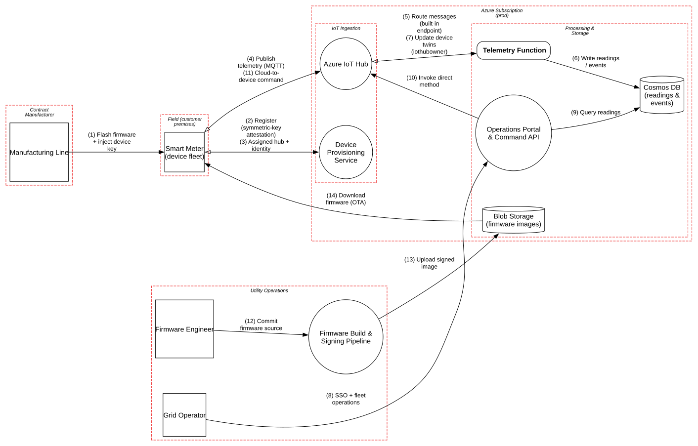

# IoT Device Fleet on Azure

> Smart meters on Azure IoT Hub, where attackers can hold the device in their hands and a single cloud command can switch off a neighborhood's power.

**Tier:** Cloud · **Standards:** ETSI EN 303 645, NIST IR 8259A (IoT device baseline), IEC 62443-4-2, Azure IoT security baseline (Microsoft Cloud Security Benchmark), NERC CIP (where applicable), NIST SP 800-193 (firmware resiliency)

## System Overview & Context

A utility runs a fleet of smart electricity meters on Azure:

1. During manufacturing, each meter gets firmware and a **unique symmetric key** derived from an enrollment-group key.
2. On first power-up, the meter registers with the **Device Provisioning Service (DPS)** and is assigned to an **IoT Hub**.
3. It publishes **interval readings** and tamper and outage events over MQTT/TLS. An **Azure Function** processes them into **Cosmos DB**.
4. Grid operators use a portal to send **direct methods**: reboot, and **remote disconnect / reconnect** of the customer's supply.
5. Firmware updates are signed in a build pipeline (key in Managed HSM), stored in **Blob Storage**, and delivered over the air.

IoT turns two standard cloud assumptions upside down. **The client is physically in the attacker's hands**: anyone can buy, steal or open a meter. And **cloud actions have physical effects**: a disconnect command cuts electricity, which makes misuse a safety and grid-stability issue as well as a data issue.

## Architecture Highlights

| Component | Boundary | Key controls |
|---|---|---|
| Smart Meter | Field | Per-device key in **internal flash (no secure element)**, A/B firmware slots, signature check on update |
| Manufacturing Line | Contract manufacturer | Isolated key-injection station |
| Device Provisioning Service | IoT ingestion | Symmetric-key enrollment group |
| Azure IoT Hub | IoT ingestion | Per-device identities, TLS 1.2+, twins, direct methods |
| Telemetry Function | Processing | Event-triggered parsing; **`iothubowner` connection string** |
| Operations Portal & Command API | Processing | Entra ID SSO + Conditional Access; **unbounded bulk disconnect** |
| Cosmos DB | Processing | Encrypted; readings reveal occupancy patterns (personal data under GDPR) |
| Blob Storage (firmware) | Processing | Signed images; **anonymous blob read** |
| Firmware Build & Signing | Utility operations | Signing key in Managed HSM |

**Trust boundaries.** The **Field** boundary is drawn as hostile and physically accessible (`hasPhysicalAccess=True`), so pytm raises reverse-engineering findings that are *accepted*: the design must not rely on firmware secrecy. The **Contract Manufacturer** is a separate boundary because that's where every device secret is born.



## Automated STRIDE Threat Analysis

| STRIDE | Key threats (pytm IDs) | Assessment |
|---|---|---|
| **Spoofing** | `HA02`, `HA04`, `CR01` | Reverse engineering of the meter is **accepted** as a given. Operator sessions are **mitigated** with Entra ID and Conditional Access. Device-identity cloning is covered in manual analysis (M1). |
| **Tampering** | – | No open pytm findings: firmware is signed in an HSM-backed pipeline. Manual review covers rollback and the enrollment-group key (M2, M3). |
| **Repudiation** | – | No open findings; IoT Hub, Function and portal diagnostics go to Log Analytics. |
| **Information Disclosure** | `CLD01` on *Blob Storage (firmware images)* | **Open, Very High.** The firmware container allows **anonymous read** so meters can download without SAS tokens. Anyone can enumerate and download every firmware version, including debug builds and update manifests. That gives a researcher or attacker the binaries to diff for vulnerabilities, and the exact rollout schedule. |
| **Information Disclosure** | `DS06` on *Update device twins* | **Open, Very High.** The Telemetry Function holds the **`iothubowner`** connection string. That secret can create and delete device identities and send commands to every meter, and it sits in an internet-triggered function's configuration. |
| **Denial of Service** | `DO01`, `DO02` on *Command API* | **Open.** There are no rate or scope limits on direct methods. One operator account (or a stolen session) can **disconnect thousands of meters in one bulk action**. In grid terms that's a sudden load drop. The 2015–2016 Ukraine grid attacks used exactly this kind of operator-tool abuse. |
| **Elevation of Privilege** | `CLD02` on *Telemetry Function* | **Open, High.** Same root cause as `DS06`. A code-execution bug triggered by a malicious telemetry payload from a tampered meter escalates straight to **fleet-wide control**. |

### Threats beyond the rule engine (manual analysis)

| # | Threat | Reference | Status |
|---|---|---|---|
| M1 | **Device key extraction and cloning.** Keys sit in internal flash with no secure element. Glitching or a debug-port read on one meter yields its key, so the attacker can impersonate that meter (falsify readings, suppress tamper events). | ETSI EN 303 645 §5.4, IEC 62443-4-2 CR 1.5 | **Gap** (hardware); limit blast radius to one device and detect duplicate-identity connections |
| M2 | **Enrollment-group key compromise.** If the group key leaks from the factory, every past and future device key can be derived, and any number of fake meters can enroll. | NIST IR 8259A | **Gap**: switch to X.509 or TPM attestation with per-device certificates; keep the group key only in an HSM at the manufacturer |
| M3 | **Firmware rollback.** A signed but *vulnerable* old image is replayed through the update channel. | NIST SP 800-193 | **Gap**: enforce monotonic version counters (anti-rollback) in the bootloader |
| M4 | **Malicious telemetry payloads** from a tampered meter targeting the parser | OWASP IoT Top 10 I3 | Partially mitigated: schema validation in the Function; fuzz the parser |
| M5 | **Debug interfaces** (JTAG/SWD, UART) left enabled in production | OWASP IoT Top 10 I2 | **Gap**: lock debug ports at end of line; verify on sampled production units |

## Mitigation Strategy & Recommendations

| Priority | Recommendation | Addresses | Mapping |
|---|---|---|---|
| **P1** | **Make firmware storage private.** Disable anonymous access, serve images through Device Update for IoT Hub with short-lived SAS URLs or a CDN with token auth, and remove debug builds. | `CLD01` | MCSB DP-2, CIS Azure 3.7 |
| **P1** | **Replace `iothubowner` with a managed identity** and the minimum data-plane roles (`IoT Hub Twin Contributor` scoped to the hub). Never hold a registry-write or service-connect secret in an internet-triggered function. | `CLD02`, `DS06` | MCSB IM-3, PA-7 |
| **P1** | **Bound the blast radius of commands.** Per-operator rate limits on direct methods, a hard cap per action (e.g. 50 meters), two-person approval for bulk disconnects, a dedicated "Disconnect" role, and a grid-operations interlock that checks feeder load. | `DO01`, `DO02` | IEC 62443-3-3 SR 2.1, NERC CIP-005 |
| **P2** | **Move to X.509 per-device certificates**, ideally on a secure element or TPM, issued by the manufacturer's HSM-backed CA. Retire the symmetric enrollment group. | M1, M2 | ETSI EN 303 645 §5.4 |
| **P2** | Enforce **anti-rollback** and secure boot in the bootloader; lock JTAG/SWD at end of line. | M3, M5 | NIST SP 800-193, IEC 62443-4-2 |
| **P3** | Detect **duplicate device identities** (same ID connecting from different networks) and anomalous telemetry. | M1 | Microsoft Defender for IoT |

**Residual risk.** Physical attacks on individual meters can't be eliminated on this hardware generation. The design goal is that compromising one meter yields **one meter**: no shared secrets on devices, no fleet-wide credentials in the cloud path, and no single action that can affect the whole fleet.

## Run it

```bash
python model.py --dfd | dot -Tsvg -o dfd.svg
python model.py --json findings.json
```

<!-- atlas:findings:begin -->
<!-- Generated by tools/atlas.py refresh. Do not edit by hand. -->

### pytm Findings Register

`pytm` evaluated **11 elements** and **14 dataflows** against **135 threat rules** and produced **18 findings**: **5 open** and 13 with a recorded response (mitigated, transferred or accepted, set via `overrides` in `model.py`).

| STRIDE | Open | Responded | Total |
|---|---:|---:|---:|
| Spoofing | 0 | 3 | 3 |
| Tampering | 0 | 0 | 0 |
| Repudiation | 0 | 0 | 0 |
| Information Disclosure | 2 | 10 | 12 |
| Denial of Service | 2 | 0 | 2 |
| Elevation of Privilege | 1 | 0 | 1 |
| **Total** | **5** | **13** | **18** |

#### Open findings

| Threat | Element | STRIDE | Severity |
|---|---|---|---|
| `CLD01` Publicly Accessible Object Storage | Blob Storage (firmware images) | Information Disclosure | Very High |
| `DS06` Data Leak | Update device twins (iothubowner) | Information Disclosure | Very High |
| `CLD02` Over-Privileged Cloud Workload Identity | Telemetry Function | Elevation of Privilege | High |
| `DO01` Flooding | Operations Portal & Command API | Denial of Service | Medium |
| `DO02` Excessive Allocation | Operations Portal & Command API | Denial of Service | Medium |

<details>
<summary>Findings with a recorded response (13)</summary>

| Threat | Element | Severity | Status | Rationale |
|---|---|---|---|---|
| `AC22` Credentials Aging | Flash firmware + inject device key | High | Accepted | device keys cannot be rotated in the field on this hardware; tracked in the README as M2 |
| `AC22` Credentials Aging | Update device twins (iothubowner) | High | Accepted | tracked as CLD02 - replace with managed identity and a scoped role |
| `CR01` Session Sidejacking | Operations Portal & Command API | High | Mitigated | Entra ID session cookies (Secure, HttpOnly) with Conditional Access |
| `DE03` Sniffing Attacks | Assigned hub + identity | Medium | Mitigated | TLS 1.2+ with server certificate validation (cellular APN for meters) |
| `DE03` Sniffing Attacks | Cloud-to-device command | Medium | Mitigated | TLS 1.2+ with server certificate validation (cellular APN for meters) |
| `DE03` Sniffing Attacks | Commit firmware source | Medium | Mitigated | TLS 1.2+ with server certificate validation (cellular APN for meters) |
| `DE03` Sniffing Attacks | Download firmware (OTA) | Medium | Mitigated | TLS 1.2+ with server certificate validation (cellular APN for meters) |
| `DE03` Sniffing Attacks | Flash firmware + inject device key | Medium | Mitigated | keys injected on an isolated provisioning station inside the factory |
| `DE03` Sniffing Attacks | Publish telemetry (MQTT) | Medium | Mitigated | TLS 1.2+ with server certificate validation (cellular APN for meters) |
| `DE03` Sniffing Attacks | Register (symmetric-key attestation) | Medium | Mitigated | TLS 1.2+ with server certificate validation (cellular APN for meters) |
| `DE03` Sniffing Attacks | SSO + fleet operations | Medium | Mitigated | TLS 1.2+ with server certificate validation (cellular APN for meters) |
| `HA02` White Box Reverse Engineering | Smart Meter (device fleet) | Medium | Accepted | attackers can buy or remove a meter and read out its firmware; no secrets may depend on firmware secrecy |
| `HA04` Reverse Engineering | Smart Meter (device fleet) | Low | Accepted | firmware reverse engineering is assumed; security relies on per-device keys and signed updates |

</details>

<!-- atlas:findings:end -->
