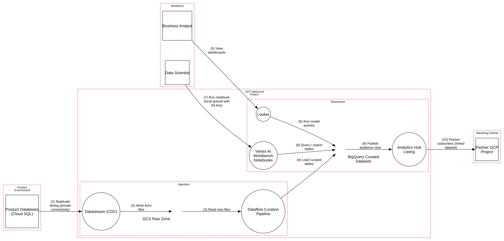

# Analytics Lakehouse on Google Cloud

> A CDC-fed lakehouse on GCS and BigQuery, where the risk isn't the perimeter but who can read, copy and export the company's entire customer history.

**Tier:** Cloud · **Standards:** CIS Google Cloud Platform Foundation Benchmark v3, Google Cloud security foundations blueprint, NIST SP 800-53 (AC-6, AU-2, SC-7), GDPR Art. 25/28/32, CCPA

## System Overview & Context

A retail company centralizes analytics on Google Cloud:

1. **Datastream** replicates change data from product databases (Cloud SQL) into a **raw zone** on Cloud Storage, unmasked.
2. A **Dataflow** pipeline curates it into **BigQuery**: deduplicates, enforces schemas, tokenizes emails, and applies **policy tags** to PII columns and **row-level access policies** by region.
3. **Analysts** use **Looker** dashboards. **Data scientists** use **Vertex AI Workbench** notebooks.
4. An aggregated **audience** dataset (hashed email + segment) is shared with a marketing partner through **Analytics Hub**.

A lakehouse's value is that it puts *all* customer data in one queryable place, which also makes it the single best target for exfiltration. Cloud-native controls exist for almost every risk here (VPC Service Controls, Data Access logs, policy tags, workload identity). The threats come from the **defaults that are off** and the **shortcuts teams take for convenience**.

## Architecture Highlights

| Component | Boundary | Key controls |
|---|---|---|
| Datastream | Ingestion | Private connectivity to Cloud SQL replicas |
| GCS Raw Zone | Ingestion | CMEK, uniform bucket-level access, public access prevention; **Data Access logs off** |
| Dataflow | Ingestion | Dedicated worker service account; email tokenization |
| BigQuery | Warehouse | Policy tags, row-level security, CMEK, Data Access logs on |
| Looker | Warehouse | Google SSO; queries via a scoped service account |
| Vertex AI Workbench | Warehouse | **Shared SA with `roles/bigquery.admin`, downloaded JSON key, open egress** |
| Analytics Hub | Warehouse | Listing of an authorized view to the partner |

**Trust boundaries.** The project is one boundary, which is the core weakness: there is **no VPC Service Controls perimeter**. Any principal with BigQuery permissions can `bq cp` or `EXPORT DATA` to a bucket or project *outside* the organization, and IAM alone can't stop that.



## Automated STRIDE Threat Analysis

| STRIDE | Key threats (pytm IDs) | Assessment |
|---|---|---|
| **Spoofing** | `AC22` on *Run notebook* | **Open, High.** Data scientists use a **downloaded service-account JSON key** with `gcloud` on laptops. The key never expires, is shared across the team, and authenticates as `bigquery.admin`. Leaked SA keys are the most common root cause of GCP data breaches. |
| **Tampering** | `AC15` | **Open.** The notebook SA can rewrite curated tables and schemas, so an exploratory notebook bug can silently corrupt production data. |
| **Repudiation** | `CLD06` on *GCS Raw Zone* | **Open.** **Data Access audit logs are disabled by default** in GCP, and they were never enabled for Cloud Storage. Nobody can tell who read the unmasked raw files. |
| **Information Disclosure** | `DS06` on *Run notebook* and *Partner subscribes* | **Open, Very High.** A SECRET credential sits on a laptop of a user cleared for SENSITIVE data. Hashed emails go to a partner cleared only for RESTRICTED data. **Hashed emails are still personal data** under GDPR: they are trivially re-identifiable by anyone holding a list of emails, which a marketing partner does by definition. |
| **Information Disclosure** | `CLD03` on *Notebooks* | **Open, High.** Notebooks have **unrestricted internet egress**, so any `pip install` dependency or pasted code snippet can upload a DataFrame anywhere, or query the metadata server for the SA token. |
| **Denial of Service** | – | No pytm findings. Manual review flags runaway query cost (M3). |
| **Elevation of Privilege** | `CLD02`, `AC12`, `AC13` on *Notebooks* | **Open, High.** `roles/bigquery.admin` at project level can **drop or rewrite row-level access policies**, change table schemas, and copy, export or delete any dataset. The row-level controls are only advisory for anyone holding this shared SA, and column-level protection rests entirely on the separate policy-tag roles never being granted alongside it. |

### Threats beyond the rule engine (manual analysis)

| # | Threat | Reference | Status |
|---|---|---|---|
| M1 | **Cross-project exfiltration** with `bq cp`, `EXPORT DATA` or a scheduled query writing to an external project | CIS GCP 7.x; Google security foundations | **Gap**: no VPC Service Controls perimeter around `data-prod` |
| M2 | **Raw-zone bypass.** Anyone with `storage.objects.get` on the raw bucket reads unmasked data and skips BigQuery policy tags entirely. | GDPR Art. 25 | **Gap**: restrict raw bucket to the Dataflow and Datastream SAs only |
| M3 | **Query cost DoS.** An unbounded `SELECT *` or a runaway scheduled query on on-demand pricing. | NIST SC-5 | **Gap**: custom quotas per user and project; reservations with caps |
| M4 | **Looker over-sharing.** A Looker SA with broader access than the analysts behind it creates a confused deputy. | NIST AC-6 | Mitigated: Looker uses per-user OAuth for PII Explores |
| M5 | **Right-to-erasure gaps.** Deleted customers persist in the raw zone, time-travel windows and partner copies. | GDPR Art. 17 | **Gap**: erasure pipeline that covers raw files, BigQuery snapshots and partner notifications |

## Mitigation Strategy & Recommendations

| Priority | Recommendation | Addresses | Mapping |
|---|---|---|---|
| **P1** | **Eliminate SA keys.** Enforce the org policy `iam.disableServiceAccountKeyCreation`, delete existing keys, and have scientists authenticate as themselves (user credentials) or impersonate a scoped SA with `iam.serviceAccounts.getAccessToken` (short-lived, audited). | `AC22`, `DS06` | CIS GCP 1.4, 1.6 |
| **P1** | **Least privilege for notebooks**: `roles/bigquery.dataViewer` on curated datasets + `jobUser` on a sandbox project. No admin, no write to curated. Keep the policy-tag roles (Policy Tag Admin, Fine-Grained Reader) with a separate data-governance group. | `CLD02`, `AC12`, `AC13`, `AC15` | CIS GCP 1.5, NIST AC-6 |
| **P1** | **Create a VPC Service Controls perimeter** around `data-prod` (BigQuery, GCS, Vertex AI), with ingress/egress rules only for the partner listing and approved projects. | M1, `CLD03` | Google security foundations blueprint |
| **P2** | **Enable Data Access audit logs** for Cloud Storage and BigQuery, sink them to a locked log bucket, and alert on bulk reads of the raw zone. | `CLD06` | CIS GCP 2.1, NIST AU-2 |
| **P2** | **Restrict notebook egress**: no external IP, Private Google Access only, packages through Artifact Registry remote repositories. | `CLD03` | NIST SC-7 |
| **P2** | **Re-design partner sharing**: use a **data clean room** (Analytics Hub clean rooms with aggregation thresholds) instead of row-level hashed emails, and sign a DPA. | `DS06` | GDPR Art. 28, 32 |
| **P3** | Query cost guardrails (custom quotas, reservations) and an erasure pipeline covering every copy. | M3, M5 | – |

**Residual risk.** Analysts and scientists legitimately read sensitive data, so insider risk remains. Mitigate it with Data Access logs, anomaly detection on query volume and destinations, and keeping the *unmasked* raw zone out of human reach entirely.

## Run it

```bash
python model.py --dfd | dot -Tsvg -o dfd.svg
python model.py --json findings.json
```

<!-- atlas:findings:begin -->
<!-- Generated by tools/atlas.py refresh. Do not edit by hand. -->

### pytm Findings Register

`pytm` evaluated **11 elements** and **10 dataflows** against **135 threat rules** and produced **14 findings**: **9 open** and 5 with a recorded response (mitigated, transferred or accepted, set via `overrides` in `model.py`).

| STRIDE | Open | Responded | Total |
|---|---:|---:|---:|
| Spoofing | 1 | 1 | 2 |
| Tampering | 1 | 0 | 1 |
| Repudiation | 1 | 0 | 1 |
| Information Disclosure | 3 | 4 | 7 |
| Denial of Service | 0 | 0 | 0 |
| Elevation of Privilege | 3 | 0 | 3 |
| **Total** | **9** | **5** | **14** |

#### Open findings

| Threat | Element | STRIDE | Severity |
|---|---|---|---|
| `DS06` Data Leak | Partner subscribes (linked dataset) | Information Disclosure | Very High |
| `DS06` Data Leak | Run notebook (local gcloud with SA key) | Information Disclosure | Very High |
| `AC12` Privilege Escalation | Vertex AI Workbench Notebooks | Elevation of Privilege | High |
| `AC15` Schema Poisoning | Vertex AI Workbench Notebooks | Tampering | High |
| `AC22` Credentials Aging | Run notebook (local gcloud with SA key) | Spoofing | High |
| `CLD02` Over-Privileged Cloud Workload Identity | Vertex AI Workbench Notebooks | Elevation of Privilege | High |
| `CLD03` SSRF to Cloud Metadata or Internal Control Plane | Vertex AI Workbench Notebooks | Information Disclosure | High |
| `AC13` Hijacking a privileged process | Vertex AI Workbench Notebooks | Elevation of Privilege | Medium |
| `CLD06` Missing Cloud Control-Plane Audit Trail | GCS Raw Zone | Repudiation | Medium |

<details>
<summary>Findings with a recorded response (5)</summary>

| Threat | Element | Severity | Status | Rationale |
|---|---|---|---|---|
| `CR01` Session Sidejacking | Looker | High | Mitigated | Google SSO sessions (Secure, HttpOnly), 12h max lifetime |
| `DE03` Sniffing Attacks | Partner subscribes (linked dataset) | Medium | Mitigated | TLS 1.2+ (Google front ends; private connectivity for CDC) |
| `DE03` Sniffing Attacks | Replicate binlog (private connectivity) | Medium | Mitigated | TLS 1.2+ (Google front ends; private connectivity for CDC) |
| `DE03` Sniffing Attacks | Run notebook (local gcloud with SA key) | Medium | Mitigated | TLS 1.2+ (Google front ends; private connectivity for CDC) |
| `DE03` Sniffing Attacks | View dashboards | Medium | Mitigated | TLS 1.2+ (Google front ends; private connectivity for CDC) |

</details>

<!-- atlas:findings:end -->
