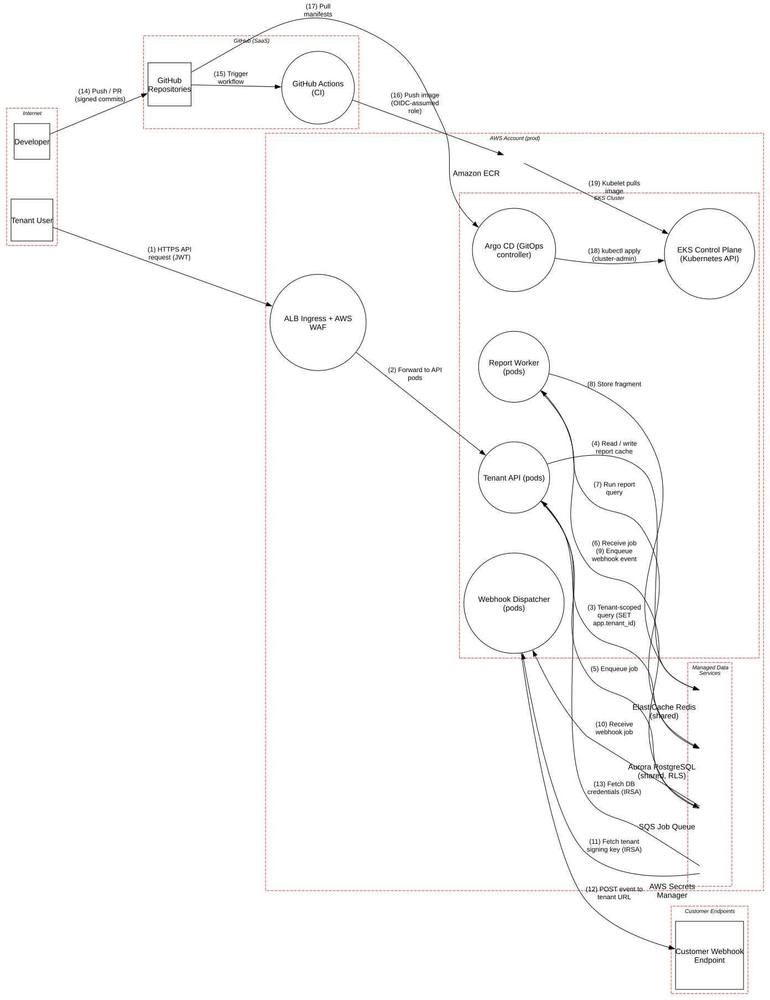

# Multi-Tenant SaaS on Amazon EKS

> Pooled multi-tenancy on Kubernetes with a GitOps pipeline, where tenant isolation, outbound requests and the deploy path are the three ways to own every customer at once.

**Tier:** Cloud · **Standards:** AWS SaaS Lens (tenant isolation), CIS Amazon EKS Benchmark, NSA/CISA Kubernetes Hardening Guide, SLSA v1.0, NIST SP 800-204D, OWASP API Security Top 10 2023

## System Overview & Context

A B2B analytics product serves thousands of tenants from **shared infrastructure** (the "pool" model): one set of API and worker deployments on EKS, one Aurora PostgreSQL cluster, one Redis cache. Pooling is cost-efficient, but any isolation failure is a **cross-tenant breach**, the worst-case event for a SaaS company.

The platform also:

- **Calls out** to customer-configured webhook URLs, which means user-controlled destinations from inside the VPC.
- Uses **GitOps** delivery: GitHub Actions builds and signs images and pushes them to ECR through an OIDC-federated role; Argo CD pulls manifests from Git and reconciles them into the cluster.

## Architecture Highlights

| Component | Boundary | Role | Key controls |
|---|---|---|---|
| ALB Ingress + AWS WAF | AWS account | TLS, WAF, per-tenant rate-based rules | TLS 1.3 |
| Tenant API | EKS cluster | JWT validation, sets `app.tenant_id` per DB session | IRSA, mesh mTLS, PSA `restricted` |
| Report Worker | EKS cluster | Async, tenant-scoped report generation | Tenant ID carried in job and re-verified |
| Webhook Dispatcher | EKS cluster | Signs and delivers events to tenant URLs | HMAC signing keys per tenant |
| Aurora PostgreSQL | Managed data | Pooled schema with row-level security | `FORCE ROW LEVEL SECURITY`, non-owner app role |
| ElastiCache Redis | Managed data | Report fragment cache | TLS, AUTH |
| SQS | Managed data | Job queue with DLQ | SSE-KMS |
| Secrets Manager | Managed data | DB credentials, per-tenant signing keys | Rotation, IRSA-scoped access |
| GitHub Actions → ECR | GitHub / AWS | Build, scan, sign (cosign keyless), push | OIDC to AWS, no static keys |
| Argo CD → EKS API | EKS cluster | GitOps reconciliation | Private API endpoint, audit logs |

**Trust boundaries.** The tenant boundary is **logical, not physical**. It exists only in the JWT claim, the RLS policy and the cache key scheme. The model encodes this with the Atlas attributes `isMultiTenant` and `enforcesTenantIsolation`. The second critical boundary is **GitHub (SaaS) → cluster**: whatever reaches the main branch or ECR runs in production.



## Automated STRIDE Threat Analysis

| STRIDE | Key threats (pytm IDs) | Assessment |
|---|---|---|
| **Spoofing** | `AA01`, `AA02`, `AA03` | Ingress findings are **transferred** to JWT validation in the API service. |
| **Tampering** | `CLD07`, `SC05` on *Argo CD* | **Open, Very High.** CI signs images, but **nothing verifies the signatures at admission**. Anyone who can push to ECR, or change an image reference in Git, can deploy an unsigned image. Signing without verification is only theater. |
| **Repudiation** | – | No open findings: EKS audit logs and CloudTrail are enabled; Argo CD sync history is retained. |
| **Information Disclosure** | `CLD08`, `CLD03`, `DS06` | **Open, Very High.** (1) Redis keys are `report:{sha256(query)}` with **no tenant prefix**, so two tenants running the same report template share a cache entry. That is a direct cross-tenant leak which RLS cannot prevent, because the cache sits in front of the database. (2) The Webhook Dispatcher will POST to *any* URL, including `http://169.254.169.254/` or in-cluster services, so it is a textbook SSRF. (3) The same dispatcher can read **every tenant's signing key** (`DS06`), so a compromise of the most exposed component forges webhooks for all customers. |
| **Denial of Service** | – | No pytm findings. Manual review flags noisy-neighbor resource exhaustion (M3). |
| **Elevation of Privilege** | `CLD02` on *Argo CD* | **Open, High.** Argo CD runs with `cluster-admin`. A malicious manifest (from a compromised repo, a dependency-confusion Helm chart, or an Argo CD CVE) can create privileged pods, read every Secret, and assume any IRSA role in the cluster. |

### Threats beyond the rule engine (manual analysis)

| # | Threat | STRIDE | Status |
|---|---|---|---|
| M1 | **RLS bypass by connection-pool session leakage.** `app.tenant_id` set with `SET` (not `SET LOCAL`) persists on pooled connections. | Information Disclosure | **Gap**: use `SET LOCAL` inside a transaction, or reset on checkout; the app role must not own tables (`FORCE ROW LEVEL SECURITY`) |
| M2 | **Tenant ID trusted from the job message** in the worker | Elevation of Privilege | Mitigated: the worker re-reads report ownership from the DB under RLS |
| M3 | **Noisy neighbor.** One tenant's heavy report saturates shared workers and DB connections. | Denial of Service | **Gap**: per-tenant concurrency quotas in the queue consumer; statement timeouts |
| M4 | **GitHub Actions poisoned pipeline execution** through `pull_request_target` or script injection from `${{ github.event.* }}` | Tampering | Mitigated: no `pull_request_target`; third-party actions pinned by SHA |
| M5 | **Pod escape to node → IRSA token theft** of co-located pods | Elevation of Privilege | Partially mitigated: PSA `restricted`; **gap**: no separate node groups for internet-facing (dispatcher) vs data-plane pods |

## Mitigation Strategy & Recommendations

| Priority | Recommendation | Addresses | Mapping |
|---|---|---|---|
| **P1** | Prefix every cache key with the tenant (`t:{tenant_id}:report:{hash}`) in one shared client wrapper, so call sites can't forget it. Add an integration test that runs the same report for two tenants and asserts cache isolation. | `CLD08` | OWASP API1:2023 (BOLA), AWS SaaS Lens |
| **P1** | Route all webhook delivery through an egress proxy (e.g. Smokescreen) that resolves DNS and denies private, link-local and cluster CIDRs. Enforce IMDSv2 with hop limit 1 and a NetworkPolicy blocking `169.254.169.254`. Run the dispatcher on its own node group. | `CLD03`, M5 | OWASP Top 10 A10:2021, NIST SC-7 |
| **P1** | Enforce image signature and SLSA provenance verification at admission (Kyverno `verifyImages` or Sigstore policy-controller), requiring the CI workflow identity as the signer. | `CLD07`, `SC05` | SLSA Build L3, NIST SP 800-204D |
| **P2** | Scope Argo CD per AppProject with a namespace allow-list and a ClusterRole without `secrets` or `*` verbs. Disable cluster-scoped resources except through a separate, reviewed platform project. | `CLD02` | CIS EKS 4.1, NIST AC-6 |
| **P2** | Give the dispatcher a per-delivery, tenant-scoped signing capability (KMS `Sign` with an encryption context bound to the tenant) instead of raw keys for all tenants. | `DS06` | NIST SC-12 |
| **P2** | Fix RLS session handling (`SET LOCAL`) and add a CI test that runs every repository query as tenant A against tenant B's data. | M1 | OWASP ASVS V8 |
| **P3** | Add per-tenant quotas on queue consumption and DB statement timeouts. | M3 | AWS SaaS Lens: noisy neighbor |

**Residual risk.** Pooled isolation never offers hard guarantees. For regulated or very large tenants, offer a **silo** tier (dedicated namespace, node group, database and KMS key) behind the same control plane.

## Run it

```bash
python model.py --dfd | dot -Tsvg -o dfd.svg
python model.py --json findings.json
```

<!-- atlas:findings:begin -->
<!-- Generated by tools/atlas.py refresh. Do not edit by hand. -->

### pytm Findings Register

`pytm` evaluated **16 elements** and **19 dataflows** against **135 threat rules** and produced **22 findings**: **6 open** and 16 with a recorded response (mitigated, transferred or accepted, set via `overrides` in `model.py`).

| STRIDE | Open | Responded | Total |
|---|---:|---:|---:|
| Spoofing | 0 | 3 | 3 |
| Tampering | 2 | 2 | 4 |
| Repudiation | 0 | 0 | 0 |
| Information Disclosure | 3 | 6 | 9 |
| Denial of Service | 0 | 0 | 0 |
| Elevation of Privilege | 1 | 5 | 6 |
| **Total** | **6** | **16** | **22** |

#### Open findings

| Threat | Element | STRIDE | Severity |
|---|---|---|---|
| `CLD07` CI/CD Pipeline Compromise and Artifact Tampering | Argo CD (GitOps controller) | Tampering | Very High |
| `CLD08` Cross-Tenant Data Access | ElastiCache Redis (shared) | Information Disclosure | Very High |
| `DS06` Data Leak | Fetch tenant signing key (IRSA) | Information Disclosure | Very High |
| `CLD02` Over-Privileged Cloud Workload Identity | Argo CD (GitOps controller) | Elevation of Privilege | High |
| `CLD03` SSRF to Cloud Metadata or Internal Control Plane | Webhook Dispatcher (pods) | Information Disclosure | High |
| `SC05` Removing Important Client Functionality | Argo CD (GitOps controller) | Tampering | High |

<details>
<summary>Findings with a recorded response (16)</summary>

| Threat | Element | Severity | Status | Rationale |
|---|---|---|---|---|
| `AC06` Using Malicious Files | ALB Ingress + AWS WAF | Very High | Mitigated | no file uploads through the ingress |
| `AC06` Using Malicious Files | GitHub Actions (CI) | Very High | Mitigated | hosted ephemeral runners; workflows from forks never get secrets or the OIDC role |
| `AA03` Exploitation of Trusted Credentials | ALB Ingress + AWS WAF | High | Transferred | credential checks happen in the API service |
| `SC03` Embedding Scripts within Scripts | ALB Ingress + AWS WAF | High | Transferred | authorization enforced downstream; WAF filters script payloads |
| `AA01` Authentication Abuse/ByPass | ALB Ingress + AWS WAF | Medium | Transferred | JWTs are validated by the API service (and by the mesh) |
| `AA02` Principal Spoof | ALB Ingress + AWS WAF | Medium | Transferred | principal established from the verified JWT in the API |
| `AC01` Privilege Abuse | ALB Ingress + AWS WAF | Medium | Transferred | privileges evaluated by the API service |
| `AC07` Exploiting Incorrectly Configured Access Control Security Levels | ALB Ingress + AWS WAF | Medium | Transferred | access control enforced by the API service |
| `AC08` Manipulate Registry Information | ALB Ingress + AWS WAF | Medium | Accepted | managed load balancer |
| `AC09` Functionality Misuse | ALB Ingress + AWS WAF | Medium | Transferred | business-logic limits live in the API service |
| `DE03` Sniffing Attacks | HTTPS API request (JWT) | Medium | Mitigated | TLS 1.2+ with certificate validation; a VPN is not applicable to SaaS and customer endpoints |
| `DE03` Sniffing Attacks | POST event to tenant URL | Medium | Mitigated | TLS 1.2+ with certificate validation; a VPN is not applicable to SaaS and customer endpoints |
| `DE03` Sniffing Attacks | Pull manifests | Medium | Mitigated | TLS 1.2+ with certificate validation; a VPN is not applicable to SaaS and customer endpoints |
| `DE03` Sniffing Attacks | Push / PR (signed commits) | Medium | Mitigated | TLS 1.2+ with certificate validation; a VPN is not applicable to SaaS and customer endpoints |
| `DE03` Sniffing Attacks | Push image (OIDC-assumed role) | Medium | Mitigated | TLS 1.2+ with certificate validation; a VPN is not applicable to SaaS and customer endpoints |
| `DE03` Sniffing Attacks | Trigger workflow | Medium | Mitigated | TLS 1.2+ with certificate validation; a VPN is not applicable to SaaS and customer endpoints |

</details>

<!-- atlas:findings:end -->
