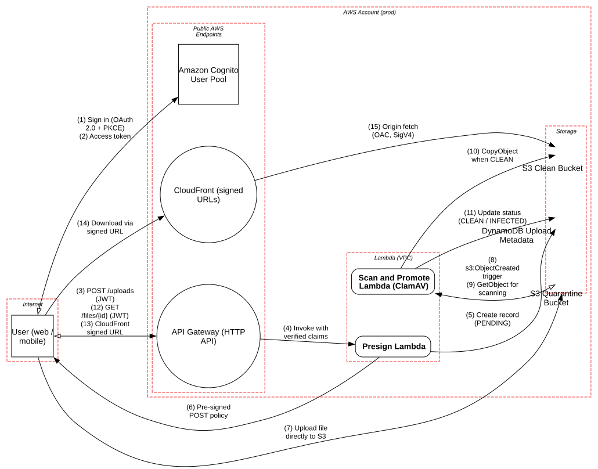

# Serverless File Upload Pipeline (AWS)

> Direct-to-S3 uploads with pre-signed URLs, event-driven malware scanning in Lambda, and quarantine/clean bucket separation, where IAM scope and event trust decide the blast radius.

**Tier:** Cloud · **Standards:** AWS Well-Architected Security Pillar, CIS AWS Foundations Benchmark v3, OWASP Serverless Top 10, OWASP File Upload Cheat Sheet, NIST SP 800-53 (AC-6, AU-2, SI-3)

## System Overview & Context

A document-heavy SaaS feature (insurance claims, KYC documents, support attachments) lets users upload files of up to 50 MB. Routing uploads through application servers would be slow and expensive, so the client uploads **directly to S3** with a short-lived pre-signed POST policy.

Every file is **untrusted until scanned**:

1. The upload lands in a **quarantine bucket** that nothing but the scanner can read.
2. `s3:ObjectCreated` triggers a container-image **Lambda** running ClamAV and libmagic type detection, which strips image metadata.
3. Clean files are copied to a **clean bucket** (versioned, Object Lock) and served only through **CloudFront signed URLs** with Origin Access Control.
4. DynamoDB tracks ownership and scan status. Download authorization checks `owner_sub` against the caller's JWT.

## Architecture Highlights

| Component | Boundary | Role | Key controls |
|---|---|---|---|
| Amazon Cognito | Public AWS endpoints | OAuth 2.0 / PKCE user authentication | Short-lived JWTs, MFA optional per user |
| API Gateway (HTTP API) | Public AWS endpoints | `/uploads`, `/files/{id}` | JWT authorizer, throttling, AWS WAF, request validation |
| Presign Lambda | Lambda (VPC) | Creates upload record, signs POST policy | 5-minute expiry, `content-length-range`, server-generated key `uploads/{sub}/{uuid}` |
| S3 Quarantine Bucket | Storage | Untrusted landing zone | Block Public Access, SSE-KMS, 24h lifecycle, scanner-only read |
| Scan and Promote Lambda | Lambda (VPC) | ClamAV + type detection + promotion | Egress only to the signature mirror via an allow-listed proxy |
| S3 Clean Bucket | Storage | Durable storage of scanned files | Versioning, Object Lock, OAC-only read, data events logged |
| DynamoDB Upload Metadata | Storage | Ownership and status | Encrypted, PITR, conditional writes |
| CloudFront | Public AWS endpoints | Delivery | Signed URLs (10 min), `Content-Disposition: attachment` |

**Trust boundaries.** The interesting boundaries are *inside* the AWS account. The Internet → S3 flow skips every application tier, so its only controls are the pre-signed policy and the bucket policy. The S3 → Lambda event flow carries attacker-controlled values (object key, user metadata, file bytes) into a privileged compute context.

**Cloud-specific rules.** This model enables the Atlas `CLD*` rules through attributes such as `isCloudWorkload`, `isObjectStorage`, `isEventTriggered` and `usesPresignedURL`.



## Automated STRIDE Threat Analysis

| STRIDE | Key threats (pytm IDs) | Assessment |
|---|---|---|
| **Spoofing** | – | No open findings. Every public flow is authenticated by a Cognito JWT, a pre-signed policy or a CloudFront signature. |
| **Tampering** | `CLD05`, `INP13`, `INP25`, `CLD04` | **Open, High.** The scanner passes the S3 object key and user metadata unquoted to `clamscan` and `exiftool` subprocesses, so a key like ``uploads/u/$(curl …).png`` becomes command injection inside the Lambda (`CLD05`, `INP13`). The POST policy limits size but **not Content-Type** (`CLD04`), so an HTML or SVG file can be stored as `image/png` and later rendered inline if a download path forgets `Content-Disposition`. |
| **Repudiation** | `CLD06` | **Open.** CloudTrail data events are not enabled on the quarantine bucket, so there is no record of who uploaded or read untrusted objects during an incident. |
| **Information Disclosure** | `AC03`, `DS05`, `DE03` | Environment-variable subversion in the scanner (`AC03`) is **open**: it follows from the same input-handling gap and would expose the signature-mirror credentials in the environment. CDN caching and transport findings are **mitigated**. |
| **Denial of Service** | – | No pytm findings. Manual review flags decompression bombs and scanner timeouts (M2). |
| **Elevation of Privilege** | `CLD02`, `INP26` | **Open, High.** The Presign Lambda's role allows `s3:PutObject` on `arn:aws:s3:::uploads-*/*`, which covers *both* buckets. A bug that lets the client influence the bucket name (or a stolen role credential) lets an attacker write straight into the **clean** bucket and skip scanning entirely. |

### Threats beyond the rule engine (manual analysis)

| # | Threat | STRIDE | Status |
|---|---|---|---|
| M1 | **Scan bypass by timing.** A consumer reads the object from quarantine (or a predictable clean key) before the scan completes. | Tampering | Mitigated: quarantine is readable only by the scanner role; clean keys are random UUIDs |
| M2 | **Decompression bombs and scanner exhaustion.** Nested archives push ClamAV to its Lambda timeout, and the file is never marked. | Denial of Service | **Gap**: set ClamAV `MaxScanSize`/`MaxRecursion`, treat timeout as INFECTED, add a DLQ and alarm on `PENDING` older than 15 minutes |
| M3 | **Stale signatures.** If freshclam fails silently, scans run against old definitions. | Tampering | **Gap**: emit signature age as a metric; fail closed when older than 24h |
| M4 | **Parser exploits** in libmagic, image libraries or exiftool on hostile files | Elevation of Privilege | Partially mitigated: ephemeral Lambda sandbox; **gap**: no seccomp, read-only rootfs or patched-image SLA |
| M5 | **Cross-user file access** via `/files/{id}` | Information Disclosure | Mitigated: `owner_sub` check in a DynamoDB conditional read; signed URL path bound to object key |
| M6 | **Pre-signed URL leakage** in logs, referrers or analytics | Information Disclosure | Mitigated: 5–10 minute expiry, `Referrer-Policy: no-referrer`; URLs excluded from access logs |

## Mitigation Strategy & Recommendations

| Priority | Recommendation | Addresses | Mapping |
|---|---|---|---|
| **P1** | Never shell out with event-derived strings. Use `subprocess.run([...], shell=False)` with argument arrays, check keys against `^uploads/[0-9a-f-]{36}/[0-9a-f-]{36}$`, and drop user metadata entirely. | `CLD05`, `INP13`, `INP25`, `INP26`, `AC03` | OWASP Serverless SAS-1, CWE-78 |
| **P1** | Split the Presign role: `s3:PutObject` on `arn:aws:s3:::uploads-quarantine-prod/uploads/${aws:PrincipalTag/sub}/*` only. Add an explicit deny on the clean bucket for every principal except the scanner role, enforced by bucket policy *and* SCP. | `CLD02` | NIST AC-6, CIS AWS 1.16 |
| **P1** | Add `Content-Type` and `starts-with` conditions to the POST policy, re-detect type by magic bytes in the scanner, and serve every download with `Content-Disposition: attachment` and `X-Content-Type-Options: nosniff`. | `CLD04` | OWASP File Upload Cheat Sheet |
| **P2** | Enable CloudTrail S3 data events (read + write) on the quarantine and clean buckets, delivered to the log-archive account with Object Lock. | `CLD06` | CIS AWS 3.8–3.9, NIST AU-2 |
| **P2** | Harden the scanner: scan limits, fail-closed timeouts, a DLQ, `PENDING` age alarms, and a signature-age metric. | M2, M3 | NIST SI-3 |
| **P3** | Consider Amazon GuardDuty Malware Protection for S3 as a second, independent engine, and use Lambda code signing for all functions. | M3, M4 | Defense in depth |

**Residual risk.** Antivirus doesn't catch targeted or zero-day payloads. For high-risk formats (Office, PDF), add Content Disarm & Reconstruction (CDR), or render to an image or PDF/A for viewing so the original file is never opened.

## Run it

```bash
python model.py --dfd | dot -Tsvg -o dfd.svg
python model.py --json findings.json
```

<!-- atlas:findings:begin -->
<!-- Generated by tools/atlas.py refresh. Do not edit by hand. -->

### pytm Findings Register

`pytm` evaluated **9 elements** and **15 dataflows** against **135 threat rules** and produced **21 findings**: **11 open** and 10 with a recorded response (mitigated, transferred or accepted, set via `overrides` in `model.py`).

| STRIDE | Open | Responded | Total |
|---|---:|---:|---:|
| Spoofing | 0 | 0 | 0 |
| Tampering | 6 | 0 | 6 |
| Repudiation | 1 | 0 | 1 |
| Information Disclosure | 0 | 9 | 9 |
| Denial of Service | 0 | 0 | 0 |
| Elevation of Privilege | 4 | 1 | 5 |
| **Total** | **11** | **10** | **21** |

#### Open findings

| Threat | Element | STRIDE | Severity |
|---|---|---|---|
| `AC03` Subverting Environment Variable Values | Scan and Promote Lambda (ClamAV) | Elevation of Privilege | Very High |
| `CLD02` Over-Privileged Cloud Workload Identity | Presign Lambda | Elevation of Privilege | High |
| `CLD05` Event Injection into Event-Driven Function | Scan and Promote Lambda (ClamAV) | Tampering | High |
| `INP08` Format String Injection | Scan and Promote Lambda (ClamAV) | Tampering | High |
| `INP13` Command Delimiters | Scan and Promote Lambda (ClamAV) | Tampering | High |
| `INP24` Filter Failure through Buffer Overflow | Scan and Promote Lambda (ClamAV) | Elevation of Privilege | High |
| `INP25` Resource Injection | Scan and Promote Lambda (ClamAV) | Tampering | High |
| `INP26` Code Injection | Scan and Promote Lambda (ClamAV) | Elevation of Privilege | High |
| `CLD04` Pre-signed URL Abuse | Upload file directly to S3 | Tampering | Medium |
| `CLD06` Missing Cloud Control-Plane Audit Trail | S3 Quarantine Bucket | Repudiation | Medium |
| `INP14` Input Data Manipulation | Scan and Promote Lambda (ClamAV) | Tampering | Medium |

<details>
<summary>Findings with a recorded response (10)</summary>

| Threat | Element | Severity | Status | Rationale |
|---|---|---|---|---|
| `API01` Exploit Test APIs | Presign Lambda | High | Mitigated | single route, no debug or test stages deployed; API schema enforced at the gateway |
| `DE03` Sniffing Attacks | Access token | Medium | Mitigated | TLS 1.2+ enforced by aws:SecureTransport bucket policy and API/CloudFront security policies |
| `DE03` Sniffing Attacks | CloudFront signed URL | Medium | Mitigated | TLS 1.2+ enforced by aws:SecureTransport bucket policy and API/CloudFront security policies |
| `DE03` Sniffing Attacks | Download via signed URL | Medium | Mitigated | TLS 1.2+ enforced by aws:SecureTransport bucket policy and API/CloudFront security policies |
| `DE03` Sniffing Attacks | GET /files/{id} (JWT) | Medium | Mitigated | TLS 1.2+ enforced by aws:SecureTransport bucket policy and API/CloudFront security policies |
| `DE03` Sniffing Attacks | POST /uploads (JWT) | Medium | Mitigated | TLS 1.2+ enforced by aws:SecureTransport bucket policy and API/CloudFront security policies |
| `DE03` Sniffing Attacks | Pre-signed POST policy | Medium | Mitigated | TLS 1.2+ enforced by aws:SecureTransport bucket policy and API/CloudFront security policies |
| `DE03` Sniffing Attacks | Sign in (OAuth 2.0 + PKCE) | Medium | Mitigated | TLS 1.2+ enforced by aws:SecureTransport bucket policy and API/CloudFront security policies |
| `DE03` Sniffing Attacks | Upload file directly to S3 | Medium | Mitigated | TLS 1.2+ enforced by aws:SecureTransport bucket policy and API/CloudFront security policies |
| `DS05` Lifting Sensitive Data Embedded in Cache | CloudFront (signed URLs) | Medium | Mitigated | private content is cached per signed URL and served with Content-Disposition: attachment |

</details>

<!-- atlas:findings:end -->
