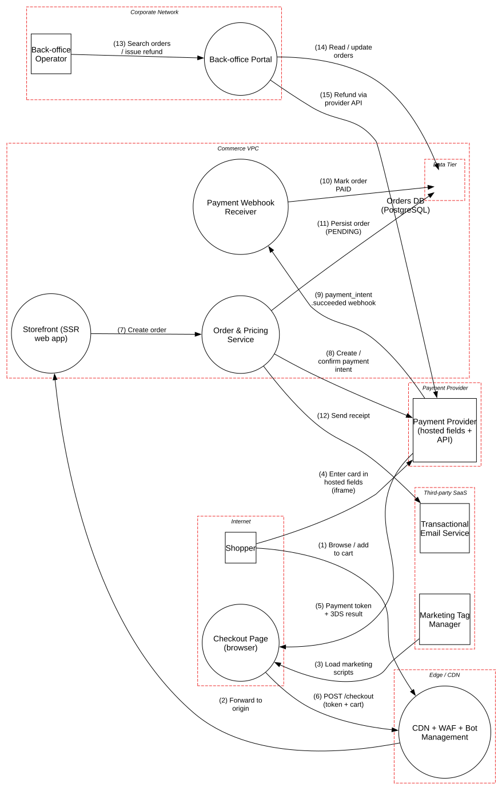

# E-commerce Checkout with Tokenized Payments

> A storefront checkout where card data goes straight to a PCI DSS Level 1 provider, and the merchant's real risks are script integrity, business logic and webhook trust.

**Tier:** Traditional · **Standards:** PCI DSS v4.0.1 (SAQ A-EP; req. 6.4.3, 11.6.1), OWASP ASVS 5.0 V2 (Business Logic), OWASP Top 10 2021

## System Overview & Context

A direct-to-consumer retailer sells physical goods online. To keep PCI DSS scope small, the checkout embeds the payment provider's **hosted fields**: iframes served by the provider that capture PAN, expiry and CVV and return a single-use token. Merchant servers never see card data.

Moving card capture to the provider removes most classic data-breach risk. What remains is less obvious:

1. **The merchant still owns the page.** Any script running on the checkout page can overlay or replace the iframes, or read form fields around them. That is the e-skimming ("Magecart") problem behind PCI DSS v4.0 requirements **6.4.3** (script inventory and authorization) and **11.6.1** (change and tamper detection).
2. **Money moves on business logic.** Price, discount and order-state decisions are where fraud happens.
3. **The provider talks back through webhooks.** These are the source of truth for "paid", so they must be authenticated and replay-safe.

## Architecture Highlights

| Component | Boundary | Role | Key controls |
|---|---|---|---|
| Checkout Page (browser) | Internet | Hosts the provider iframes plus first- and third-party JS | CSP `frame-ancestors 'none'`, CSRF tokens |
| Payment Provider | Third party | Tokenization, 3-D Secure, payment intents, signed webhooks | PCI DSS Level 1 |
| Marketing Tag Manager | Third-party SaaS | Analytics and ad pixels | **None: arbitrary script origins** |
| CDN + WAF + Bot Management | Edge | Caching, OWASP CRS, bot scoring | TLS 1.3, HSTS |
| Storefront (SSR) | Commerce VPC | Catalog, cart and checkout rendering; sessions | Session rotation, `no-store` on private pages |
| Order & Pricing Service | Commerce VPC | Server-side totals, promotions, inventory reservation, payment intents | Idempotency keys, restricted API key |
| Payment Webhook Receiver | Commerce VPC | Updates order state from provider events | HMAC signature verification |
| Back-office Portal | Corporate network | Order lookup, refunds, promotions | SSO + FIDO2, ZTNA |
| Orders DB | Data tier | Orders, addresses, token refs, last4 | Encryption at rest, parameterized queries |

**Trust boundaries.** The model separates the **Payment Provider** (high trust, contractually PCI-compliant) from **Third-party SaaS** (low trust: marketing scripts and email). Both sit outside the merchant's control, but only one is audited for cardholder-data security. That gap is the core of the analysis.

**Data flow pattern.** Card data flows *Shopper → Provider* directly. Only a token comes back through the merchant page. The order becomes PAID only through the *Provider → Webhook Receiver → Orders DB* path, never through a browser redirect.



## Automated STRIDE Threat Analysis

| STRIDE | Key threats (pytm IDs) | Assessment |
|---|---|---|
| **Spoofing** | `AA01`, `AA02`, `CR01`, `CR03` | The CDN and browser can't authenticate principals; those findings are **transferred** to the storefront session layer. Session sidejacking is **mitigated** by cookie flags and HSTS. |
| **Tampering** | `CR06` on *Load marketing scripts* | **Open, High.** Third-party JavaScript is loaded without integrity or authorization controls and runs with full privileges on the checkout page. This is the e-skimming vector: one compromised tag can overlay the hosted fields with a fake form. |
| **Repudiation** | – | No pytm findings. Manual review finds that refunds lack per-operator attribution and dual control (see M4). |
| **Information Disclosure** | `AC22`, `DE03`, `DS05` | Provider API keys are long-lived credentials; **mitigated** by restricted, separately scoped keys rotated every 90 days. Cache leakage of cart and account pages is **mitigated** with `Cache-Control: no-store`. |
| **Denial of Service** | `DO01`, `DO02` on *Order & Pricing Service* | **Open.** No velocity limits on payment-intent creation or coupon redemption. That enables **card testing**: bots validate stolen cards through low-value authorizations, which brings provider fines, chargeback ratios and possible account termination. It also enables inventory hoarding through cart reservations. |
| **Elevation of Privilege** | `AC01`, `AC12`, `AC13` | **Accepted** on the browser: all pricing and authorization is enforced server-side. |

### Threats beyond the rule engine (manual analysis)

These gaps exist in `model.py` (as controls set to `False`) but no stock pytm rule matches them. Here manual review has to fill in for the rule engine:

| # | Threat | STRIDE | Status |
|---|---|---|---|
| M1 | **Webhook replay.** Signatures are verified, but there is no timestamp tolerance or event-ID de-duplication. A captured `payment_intent.succeeded` can be replayed to mark a second order paid if it shares the same intent. | Spoofing / Tampering | **Gap** (`implementsNonce=False` on the receiver) |
| M2 | **Price and quantity tampering.** The client submits line items with prices or negative quantities. | Tampering | Mitigated: totals recalculated from the catalog server-side |
| M3 | **Race conditions on single-use coupons and limited stock.** Parallel requests redeem a coupon more than once. | Tampering | **Gap**: needs atomic conditional updates or `SELECT … FOR UPDATE` |
| M4 | **Insider refund fraud.** Any operator can refund any amount to the original card or, through support workflows, to store credit. | Elevation of Privilege / Repudiation | **Gap** (`implementsPOLP=False` on the back office) |
| M5 | **Order IDOR** on `/orders/{id}` for guest checkouts using sequential IDs | Information Disclosure | Mitigated: random 128-bit order IDs plus email verification for guest lookup |
| M6 | **Client-side "payment success" redirect trusted** as proof of payment | Spoofing | Avoided: state changes only on webhook |

## Mitigation Strategy & Recommendations

| Priority | Recommendation | Addresses | Mapping |
|---|---|---|---|
| **P1** | Keep a script inventory and lock down the checkout page: a strict CSP with nonces, `script-src` allow-list, and **no tag manager on checkout routes**. Add SRI where vendors publish versioned assets. Deploy change and tamper detection on payment pages (CSP reporting, or a client-side monitoring service). | `CR06` | PCI DSS 6.4.3, 11.6.1 |
| **P1** | Add velocity controls on payment-intent creation per session, IP, device fingerprint and BIN. Require bot-management scoring plus provider-side Radar/3DS rules. Alert when the authorization decline ratio spikes. | `DO01`, `DO02` | OWASP Automated Threats OAT-001 (Carding) |
| **P1** | Make webhook handling replay-safe: reject events older than 5 minutes (signed timestamp), store processed event IDs with a unique constraint, and make state transitions idempotent. | M1 | OWASP ASVS V2 |
| **P2** | Enforce coupon and inventory invariants in the database (unique redemption rows, conditional decrements). | M3 | OWASP ASVS V2.3 |
| **P2** | Add refund guardrails: role-based refund limits, dual approval above a threshold, refunds only to the original payment method, and per-operator audit trail. | M4 | NIST SP 800-53 AC-5, AU-10 |
| **P3** | Move provider keys to short-lived credentials where the provider supports them, or to per-service restricted keys with IP allow-listing. | `AC22` | PCI DSS 8.6 |

**Residual risk.** The largest residual risk is a compromise of the provider's own JavaScript or of the CDN serving the merchant's first-party bundles. Mitigate with SRI on first-party bundles, signed builds, and the 11.6.1 change-detection mechanism.

## Run it

```bash
python model.py --dfd | dot -Tsvg -o dfd.svg
python model.py --json findings.json
```

<!-- atlas:findings:begin -->
<!-- Generated by tools/atlas.py refresh. Do not edit by hand. -->

### pytm Findings Register

`pytm` evaluated **12 elements** and **15 dataflows** against **135 threat rules** and produced **33 findings**: **3 open** and 30 with a recorded response (mitigated, transferred or accepted, set via `overrides` in `model.py`).

| STRIDE | Open | Responded | Total |
|---|---:|---:|---:|
| Spoofing | 0 | 11 | 11 |
| Tampering | 1 | 2 | 3 |
| Repudiation | 0 | 0 | 0 |
| Information Disclosure | 0 | 10 | 10 |
| Denial of Service | 2 | 0 | 2 |
| Elevation of Privilege | 0 | 7 | 7 |
| **Total** | **3** | **30** | **33** |

#### Open findings

| Threat | Element | STRIDE | Severity |
|---|---|---|---|
| `CR06` Communication Channel Manipulation | Load marketing scripts | Tampering | High |
| `DO01` Flooding | Order & Pricing Service | Denial of Service | Medium |
| `DO02` Excessive Allocation | Order & Pricing Service | Denial of Service | Medium |

<details>
<summary>Findings with a recorded response (30)</summary>

| Threat | Element | Severity | Status | Rationale |
|---|---|---|---|---|
| `AC06` Using Malicious Files | CDN + WAF + Bot Management | Very High | Mitigated | no upload endpoints exposed; WAF blocks multipart bodies |
| `AA03` Exploitation of Trusted Credentials | CDN + WAF + Bot Management | High | Transferred | credential checks happen in the storefront |
| `AC12` Privilege Escalation | Checkout Page (browser) | High | Accepted | the browser is untrusted; pricing, authorization and payment state are enforced server-side |
| `AC22` Credentials Aging | Create / confirm payment intent | High | Mitigated | restricted API key scoped to PaymentIntents, stored in a secrets manager, rotated every 90 days |
| `AC22` Credentials Aging | Enter card in hosted fields (iframe) | High | Transferred | card data is captured and vaulted by the PCI DSS Level 1 provider; the merchant never stores it |
| `AC22` Credentials Aging | Refund via provider API | High | Mitigated | separate restricted key with refund scope only; rotated every 90 days |
| `CR01` Session Sidejacking | Back-office Portal | High | Mitigated | SSO session cookies are Secure/HttpOnly; portal reachable only via ZTNA |
| `CR01` Session Sidejacking | Storefront (SSR web app) | High | Mitigated | Secure/HttpOnly/SameSite=Lax cookies, HSTS preload, session rotation at login and checkout |
| `CR03` Dictionary-based Password Attack | Checkout Page (browser) | High | Transferred | account passwords are verified by the storefront (rate limits, breached-password screening) |
| `SC03` Embedding Scripts within Scripts | CDN + WAF + Bot Management | High | Transferred | authorization is enforced downstream; WAF filters script payloads |
| `AA01` Authentication Abuse/ByPass | CDN + WAF + Bot Management | Medium | Transferred | shopper sessions are authenticated by the storefront |
| `AA01` Authentication Abuse/ByPass | Checkout Page (browser) | Medium | Accepted | the browser is untrusted; pricing, authorization and payment state are enforced server-side |
| `AA02` Principal Spoof | CDN + WAF + Bot Management | Medium | Transferred | principal established by the storefront session |
| `AA02` Principal Spoof | Checkout Page (browser) | Medium | Accepted | the browser is untrusted; pricing, authorization and payment state are enforced server-side |
| `AC01` Privilege Abuse | CDN + WAF + Bot Management | Medium | Transferred | privileges are evaluated by the order service |
| `AC01` Privilege Abuse | Checkout Page (browser) | Medium | Accepted | the browser is untrusted; pricing, authorization and payment state are enforced server-side |
| `AC07` Exploiting Incorrectly Configured Access Control Security Levels | CDN + WAF + Bot Management | Medium | Transferred | access control is enforced by origin services |
| `AC08` Manipulate Registry Information | CDN + WAF + Bot Management | Medium | Accepted | managed CDN, no registry exposed |
| `AC09` Functionality Misuse | CDN + WAF + Bot Management | Medium | Transferred | business-logic limits live in the order service |
| `AC13` Hijacking a privileged process | Checkout Page (browser) | Medium | Accepted | the browser is untrusted; pricing, authorization and payment state are enforced server-side |
| `DE03` Sniffing Attacks | Browse / add to cart | Medium | Mitigated | TLS 1.2+ (1.3 preferred) with HSTS; a VPN is not applicable to public or SaaS endpoints |
| `DE03` Sniffing Attacks | Create / confirm payment intent | Medium | Mitigated | TLS 1.2+ (1.3 preferred) with HSTS; a VPN is not applicable to public or SaaS endpoints |
| `DE03` Sniffing Attacks | Enter card in hosted fields (iframe) | Medium | Mitigated | TLS 1.2+ (1.3 preferred) with HSTS; a VPN is not applicable to public or SaaS endpoints |
| `DE03` Sniffing Attacks | Load marketing scripts | Medium | Mitigated | TLS 1.2+ (1.3 preferred) with HSTS; a VPN is not applicable to public or SaaS endpoints |
| `DE03` Sniffing Attacks | POST /checkout (token + cart) | Medium | Mitigated | TLS 1.2+ (1.3 preferred) with HSTS; a VPN is not applicable to public or SaaS endpoints |
| `DE03` Sniffing Attacks | Payment token + 3DS result | Medium | Mitigated | TLS 1.2+ (1.3 preferred) with HSTS; a VPN is not applicable to public or SaaS endpoints |
| `DE03` Sniffing Attacks | Refund via provider API | Medium | Mitigated | TLS 1.2+ (1.3 preferred) with HSTS; a VPN is not applicable to public or SaaS endpoints |
| `DE03` Sniffing Attacks | Send receipt | Medium | Mitigated | TLS 1.2+ (1.3 preferred) with HSTS; a VPN is not applicable to public or SaaS endpoints |
| `DE03` Sniffing Attacks | payment_intent.succeeded webhook | Medium | Mitigated | TLS 1.2+ (1.3 preferred) with HSTS; a VPN is not applicable to public or SaaS endpoints |
| `DS05` Lifting Sensitive Data Embedded in Cache | Storefront (SSR web app) | Medium | Mitigated | CDN and app caches vary on session; Cache-Control: no-store on cart, checkout and account pages |

</details>

<!-- atlas:findings:end -->
