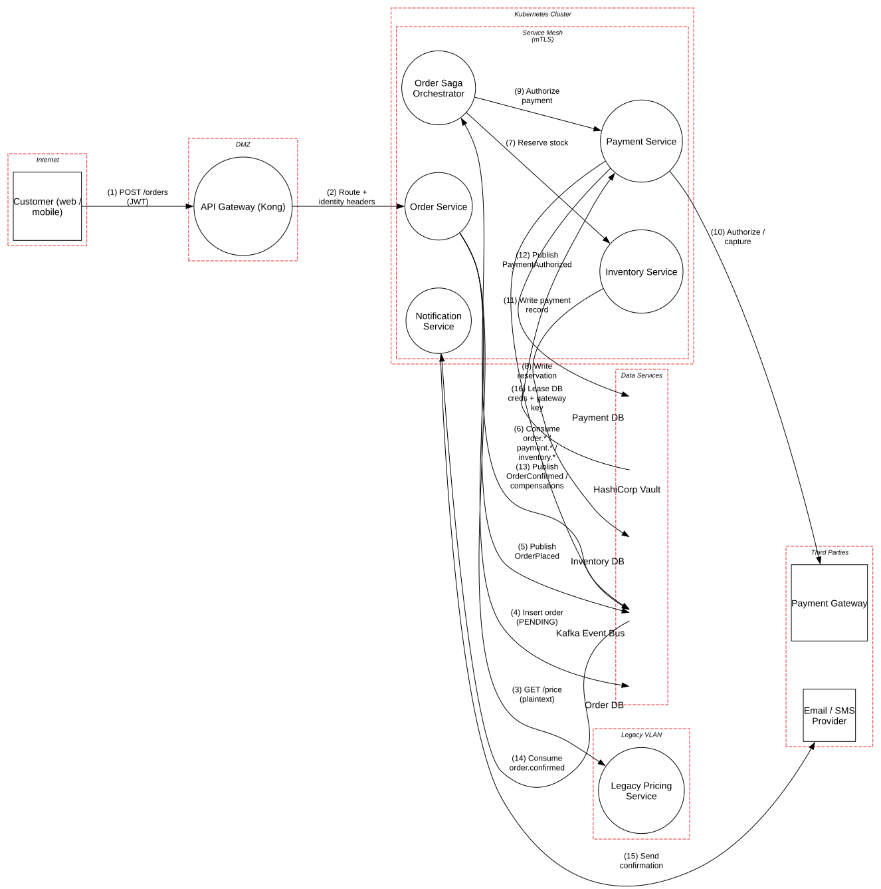

# Microservices Order Platform

> An order workflow split across services, a service mesh and a Kafka event bus, where the risk moves from the perimeter to the trust that services place in each other.

**Tier:** Traditional · **Standards:** NIST SP 800-204 / 800-204A (Microservices security, service mesh), NIST SP 800-207 (Zero Trust), OWASP API Security Top 10 2023, OWASP Microservices Security Cheat Sheet

## System Overview & Context

A retailer split its order monolith into independently deployable services running on a self-managed Kubernetes cluster in its own data center:

| Service | Owns | Talks to |
|---|---|---|
| **Order Service** | Order API, Order DB | Pricing (sync), Kafka (publish) |
| **Order Saga Orchestrator** | Workflow state | Inventory and Payment (sync), Kafka (consume and publish) |
| **Inventory Service** | Reservations, Inventory DB | – |
| **Payment Service** | Payment records, Payment DB | Payment gateway (external) |
| **Notification Service** | Templates | Email/SMS provider (external) |
| **Legacy Pricing Service** | Price rules | Not yet migrated; runs on a VM outside the mesh |

Order placement is a **saga**: reserve stock → authorize payment → confirm order → notify customer, with compensating actions (release stock, void authorization) on any failure. Each step communicates through **domain events** on Kafka.

Microservices replace one perimeter with dozens of internal trust decisions. Each service has to answer three questions on every request: *who called me*, *on whose behalf*, and *can I trust this event*. This model is about the places where those answers are weak.

## Architecture Highlights

| Component | Boundary | Key controls |
|---|---|---|
| API Gateway (Kong) | DMZ | JWT validation (sig, `iss`, `aud`, `exp`), rate limits; injects `X-User-Id` / `X-Roles` |
| Services | Service mesh | Istio STRICT mTLS, SPIFFE identities, per-service DB credentials from Vault |
| Kafka Event Bus | Data services | TLS listeners, **no topic ACLs** |
| Per-service databases | Data services | Encrypted, separate credentials per service |
| HashiCorp Vault | Data services | Kubernetes auth, dynamic DB credentials (1h TTL) |
| Legacy Pricing Service | Legacy VLAN | **Plaintext HTTP, no service authentication** |

**Trust boundaries.** The mesh boundary *looks* like a security boundary, but mTLS only proves **which workload** is calling. It says nothing about which *user* the call is for, or whether that workload should be allowed to make it. The model shows this gap explicitly: the Order Service authenticates its peers but not the identity headers they carry. The Legacy VLAN is a second, weaker boundary that the order path still crosses.



## Automated STRIDE Threat Analysis

| STRIDE | Key threats (pytm IDs) | Assessment |
|---|---|---|
| **Spoofing** | `AA01`, `AA02`, `AA03` on *Order Service* | **Open.** The Order Service scopes every query by `X-User-Id`, but **any in-mesh workload can set that header**. No Istio `AuthorizationPolicy` limits which callers may assert identity, and no signed internal token carries it. A single compromised service (e.g. via a dependency in the Notification Service) can read or cancel any customer's orders. This is the *confused deputy* pattern described in NIST SP 800-204A. |
| **Spoofing** | `AA01`–`AA03`, `CR03` on *Legacy Pricing* | **Open.** Unauthenticated: anything on the VLAN can query or call admin endpoints. |
| **Tampering** | `AC02`, `AC01` on *Kafka Event Bus* | **Open.** Kafka uses TLS but has **no per-topic ACLs**. Any workload with a cluster-CA certificate can produce `PaymentAuthorized` to `payment.events`, and the saga will confirm and ship an order that was never paid. Events are trusted as facts, so forging one is as good as forging the database. |
| **Tampering** | `CR06`, `AC05`, `CR08` on *GET /price* | **Open.** Prices travel over plaintext HTTP from the legacy VLAN. An attacker on that network can rewrite quotes in transit (ARP spoofing on a flat VLAN is trivial). |
| **Repudiation** | – | No pytm findings. Manual review notes that the event payloads carry no producer identity (M2). |
| **Information Disclosure** | `DE01`, `DE03` on *GET /price*; `DS03`, `HA03` | **Open** for the legacy hop; external flows are **mitigated** by TLS 1.2+. |
| **Denial of Service** | – | No pytm findings. Manual review flags saga retry storms (M3). |
| **Elevation of Privilege** | `AC06` on *Legacy Pricing* | **Open, Very High.** The unhardened, unpatched JVM on the VLAN is the easiest foothold into the order path. |

### Threats beyond the rule engine (manual analysis)

| # | Threat | STRIDE | Status |
|---|---|---|---|
| M1 | **BOLA across services.** The Inventory and Payment services accept `order_id` from the saga without checking that it belongs to the customer in context. | Elevation of Privilege | Mitigated: the saga is the only allowed caller (mesh policy), and the order is re-read from the Order Service |
| M2 | **No event provenance.** Consumers can't tell which service produced an event. | Repudiation / Spoofing | **Gap**: sign event envelopes (producer SPIFFE ID, JWS) or at minimum add Kafka principal headers enforced by an interceptor |
| M3 | **Saga retry storms.** A slow payment gateway causes timeouts, retries and duplicate authorizations. | Denial of Service / Tampering | Partially mitigated: idempotency keys on payment; **gap**: no circuit breaker or retry budget on the orchestrator |
| M4 | **Compensation failure.** "Release stock" or "void authorization" fails silently, leaving inconsistent state that attackers can farm (e.g. held stock). | Tampering | **Gap**: dead-letter queue and alerting on unfinished sagas |
| M5 | **Gateway bypass.** Services are reachable directly from inside the cluster without passing the gateway's checks. | Spoofing | Same root cause as the identity-header gap; fixed by P1 below |

## Mitigation Strategy & Recommendations

| Priority | Recommendation | Addresses | Mapping |
|---|---|---|---|
| **P1** | **Propagate identity as a signed token, not a header.** The gateway exchanges the customer JWT for a short-lived internal token (audience = service), and each service validates it. Add Istio `RequestAuthentication` + `AuthorizationPolicy` so only the gateway may call public routes, and only the saga may call Inventory and Payment. | `AA01`–`AA03`, M5 | NIST SP 800-204A, OWASP API2:2023 |
| **P1** | **Enable Kafka ACLs per topic.** Each service principal gets `WRITE` only on its own topics and `READ` only on the topics it consumes. Deny by default (`allow.everyone.if.no.acl.found=false`). | `AC01`, `AC02` | NIST SP 800-204 MS-SS-6 |
| **P1** | **Bring the pricing service into the mesh** (sidecar on the VM, or a mesh egress gateway with mTLS to the VLAN). Until then, put it behind an authenticating proxy and restrict the VLAN to the Order Service. | `CR06`, `AC05`, `CR08`, `DE01`, `AA*`, `AC06` | NIST SP 800-207 |
| **P2** | **Sign domain events** (or enforce producer identity in headers through a broker plugin), and have consumers verify before acting on payment or inventory facts. | M2 | NIST SP 800-204 |
| **P2** | Add a **retry budget and circuit breaker** on the saga, and alert on sagas stuck in non-terminal states. | M3, M4 | OWASP Microservices Security Cheat Sheet |
| **P3** | Patch and harden the legacy JVM (or freeze it behind a WAF) until migration completes. | `AC06`, `DS03`, `HA03` | CIS Benchmarks |

**Residual risk.** After P1, a compromised service can still misuse its *own* legitimate permissions, for example the Notification Service reading order events it is allowed to consume. Keep each service's topic and route access to the minimum it needs, and keep service count per team manageable so that review stays possible.

## Run it

```bash
python model.py --dfd | dot -Tsvg -o dfd.svg
python model.py --json findings.json
```

<!-- atlas:findings:begin -->
<!-- Generated by tools/atlas.py refresh. Do not edit by hand. -->

### pytm Findings Register

`pytm` evaluated **15 elements** and **16 dataflows** against **135 threat rules** and produced **21 findings**: **17 open** and 4 with a recorded response (mitigated, transferred or accepted, set via `overrides` in `model.py`).

| STRIDE | Open | Responded | Total |
|---|---:|---:|---:|
| Spoofing | 7 | 1 | 8 |
| Tampering | 4 | 0 | 4 |
| Repudiation | 0 | 0 | 0 |
| Information Disclosure | 4 | 3 | 7 |
| Denial of Service | 0 | 0 | 0 |
| Elevation of Privilege | 2 | 0 | 2 |
| **Total** | **17** | **4** | **21** |

#### Open findings

| Threat | Element | STRIDE | Severity |
|---|---|---|---|
| `AC06` Using Malicious Files | Legacy Pricing Service | Elevation of Privilege | Very High |
| `AA03` Exploitation of Trusted Credentials | Legacy Pricing Service | Spoofing | High |
| `AA03` Exploitation of Trusted Credentials | Order Service | Spoofing | High |
| `CR03` Dictionary-based Password Attack | Legacy Pricing Service | Spoofing | High |
| `CR06` Communication Channel Manipulation | GET /price (plaintext) | Tampering | High |
| `AA01` Authentication Abuse/ByPass | Legacy Pricing Service | Spoofing | Medium |
| `AA01` Authentication Abuse/ByPass | Order Service | Spoofing | Medium |
| `AA02` Principal Spoof | Legacy Pricing Service | Spoofing | Medium |
| `AA02` Principal Spoof | Order Service | Spoofing | Medium |
| `AC01` Privilege Abuse | Kafka Event Bus | Elevation of Privilege | Medium |
| `AC02` Shared Data Manipulation | Kafka Event Bus | Tampering | Medium |
| `AC05` Content Spoofing | GET /price (plaintext) | Tampering | Medium |
| `CR08` Client-Server Protocol Manipulation | GET /price (plaintext) | Tampering | Medium |
| `DE01` Interception | GET /price (plaintext) | Information Disclosure | Medium |
| `DE03` Sniffing Attacks | GET /price (plaintext) | Information Disclosure | Medium |
| `HA03` Web Application Fingerprinting | Legacy Pricing Service | Information Disclosure | Low |
| `DS03` Footprinting | Legacy Pricing Service | Information Disclosure | Very Low |

<details>
<summary>Findings with a recorded response (4)</summary>

| Threat | Element | Severity | Status | Rationale |
|---|---|---|---|---|
| `AC22` Credentials Aging | Lease DB creds + gateway key | High | Mitigated | Vault dynamic credentials with 1h TTL, revoked on pod termination |
| `DE03` Sniffing Attacks | Authorize / capture | Medium | Mitigated | TLS 1.2+ with certificate validation to customers and providers |
| `DE03` Sniffing Attacks | POST /orders (JWT) | Medium | Mitigated | TLS 1.2+ with certificate validation to customers and providers |
| `DE03` Sniffing Attacks | Send confirmation | Medium | Mitigated | TLS 1.2+ with certificate validation to customers and providers |

</details>

<!-- atlas:findings:end -->
