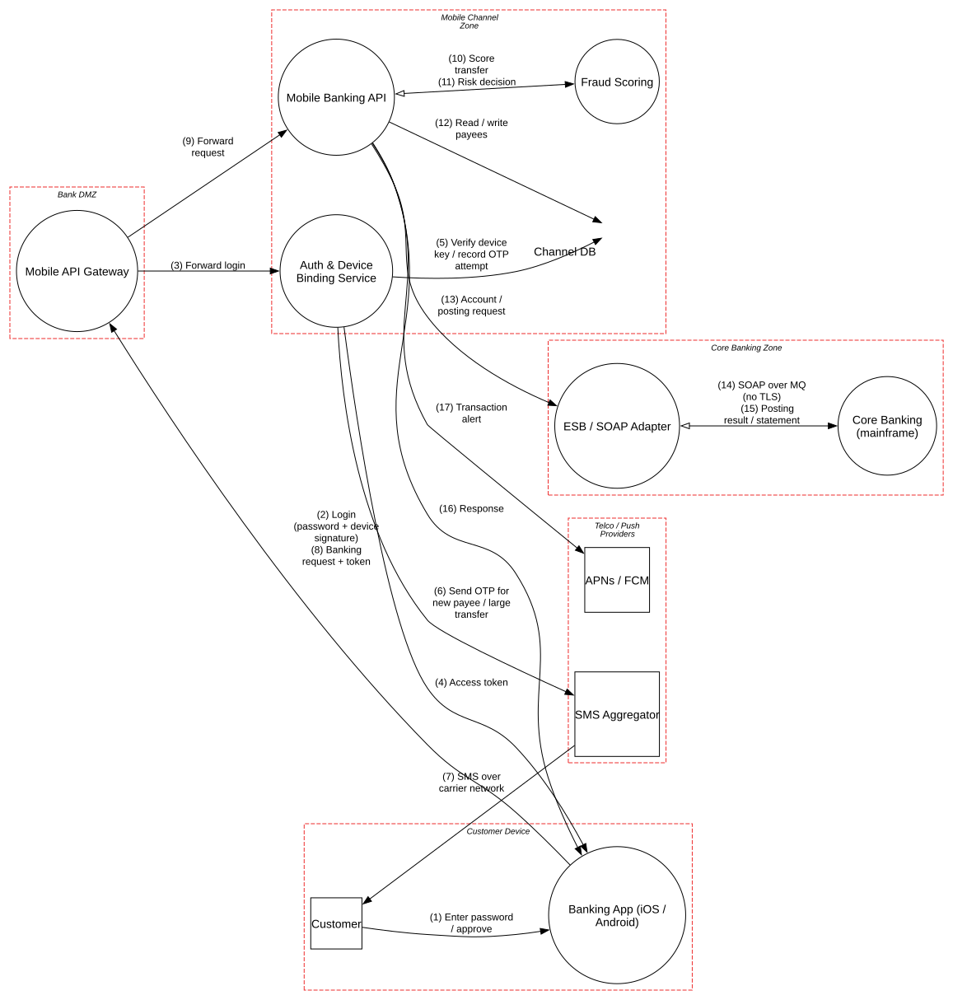

# Mobile Banking Backend

> A modern mobile channel in front of a decades-old core-banking mainframe, where the weakest links are the second factor and the XML bridge into the system of record.

**Tier:** Traditional · **Standards:** OWASP MASVS v2, OWASP Mobile Top 10 (2024), PSD2 RTS on Strong Customer Authentication, FFIEC Authentication and Access Guidance, NIST SP 800-63B, OWASP XXE Prevention Cheat Sheet

## System Overview & Context

A retail bank's iOS and Android apps let customers check balances, add payees and send transfers. The channel was rebuilt recently and follows current practice:

- Login combines a **password** with a signature from a **device-bound key pair** (Secure Enclave / StrongBox) registered at enrollment, plus **app attestation** (App Attest / Play Integrity).
- Access tokens are short-lived and bound to the device key (proof-of-possession).
- **Adding a payee** and **large transfers** require step-up verification with an **SMS one-time password**.

Behind the channel sits the bank's **core-banking mainframe**, the system of record for every account and posting. It can't be modified. It is reached through an **ESB** that turns JSON into **SOAP/XML** and puts messages on **IBM MQ**. The mainframe trusts any message that arrives on its channel.

The threat model therefore has two halves: an attacker who **controls the device** (rooted phones, repackaged apps, malware with accessibility permissions), and an attacker who reaches the **legacy integration layer**, where one forged message is a ledger entry.

## Architecture Highlights

| Component | Boundary | Key controls |
|---|---|---|
| Banking App | Customer device | Keys in hardware keystore, certificate pinning, RASP (root/hook detection) |
| Mobile API Gateway | Bank DMZ | Attestation verification, velocity rules, WAF |
| Auth & Device Binding | Mobile channel | Password + device-key signature, device-bound tokens, SMS OTP step-up |
| Mobile Banking API | Mobile channel | Fraud scoring before every posting |
| Fraud Scoring | Mobile channel | Device risk, behavioral signals, rules |
| Channel DB | Mobile channel | Device public keys, payees, OTP attempt counters |
| ESB / SOAP Adapter | Core banking | **XML parser with DTDs enabled (vendor default)** |
| Core Banking (mainframe) | Core banking | **MQ channel without TLS or channel authentication** |
| SMS Aggregator, APNs/FCM | Telco / push | Carrier-dependent; push carries no balances |

**Trust boundaries.** The **Customer Device** boundary is drawn as hostile, so every app-side finding is *accepted* with the rule "decide on the server". The model's biggest gap is that the **Core Banking Zone** is treated as trusted inside, although it is the zone with the weakest transport and parsing controls.



## Automated STRIDE Threat Analysis

| STRIDE | Key threats (pytm IDs) | Assessment |
|---|---|---|
| **Spoofing** | `AA01`, `AA02`, `CR01`, `CR03` | App-side findings are **accepted**: the device is untrusted by design and all decisions happen server-side. Token theft (`CR01`) is **mitigated** by device-bound proof-of-possession. |
| **Spoofing** | `DE03` on *SMS over carrier network* | **Open.** The step-up factor travels over SMS, which is exposed to **SIM swap**, port-out fraud, SS7 interception and on-device SMS-reading malware. Adding a payee is exactly the step an account-takeover crew needs, so the strongest-sounding control is the weakest link. |
| **Tampering** | `INP19`, `INP21`, `INP22` on *ESB / SOAP Adapter* | **Open, High.** The ESB parses XML with DTD processing enabled. A crafted field that reaches a SOAP envelope unescaped (e.g. a payee name or reference) can trigger **XXE** (read local files, SSRF into the core zone) or entity-expansion DoS. |
| **Tampering** | `CR06`, `AC05`, `AC04` on *SOAP over MQ* | **Open, High.** The MQ channel has **no TLS and no channel authentication**. Anyone who reaches the core zone network can put a posting message on the queue, and the mainframe will book it. |
| **Repudiation** | – | No pytm findings. Manual review notes that postings carry the ESB's identity, not the customer's (M3). |
| **Information Disclosure** | `DE01`, `CR08`, `DR01` on the MQ link | **Open.** Account data and PII travel in cleartext between the ESB and the mainframe. |
| **Denial of Service** | `DO03`, `INP22` | **Open.** XML bombs against the ESB can stall all mobile postings. |
| **Elevation of Privilege** | `AC12`, `AC13`, `AC15` on the app | **Accepted:** the app holds no privileges the server doesn't re-check. |

### Threats beyond the rule engine (manual analysis)

| # | Threat | Reference | Status |
|---|---|---|---|
| M1 | **Payee-add BOLA.** `POST /payees` takes `account_id` in the body; the API checks that the token is valid, but not that the account belongs to the token's customer. | OWASP API1:2023 | **Gap**: derive account ownership from the token subject; never from the request body |
| M2 | **Accessibility-service / overlay malware** (e.g. Android banking trojans) drives the genuine app on a genuine device, so attestation and device binding pass. | MASVS-RESILIENCE, Mobile Top 10 M8 | Partially mitigated: behavioral fraud signals; **gap**: no transaction confirmation that shows the beneficiary on a protected screen |
| M3 | **Loss of customer attribution** in the core: postings are booked under the ESB service account. | Non-repudiation | **Gap**: carry a signed customer/device assertion through the ESB into the posting record |
| M4 | **Enrollment takeover.** A new device is registered using only password + SMS OTP. | NIST SP 800-63B §6.1 | **Gap**: require approval from an existing bound device or an in-branch / ID-verification flow for new-device enrollment |
| M5 | **OTP brute force** across sessions | PSD2 RTS Art. 4 | Mitigated: 5 attempts per OTP, per-account lockout counters in the Channel DB |

## Mitigation Strategy & Recommendations

| Priority | Recommendation | Addresses | Mapping |
|---|---|---|---|
| **P1** | **Replace SMS OTP for payee-add and large transfers** with in-app approval signed by the device-bound key (transaction signing that shows amount and beneficiary: PSD2 "dynamic linking"). Keep SMS only as a fallback with a cooling-off period for new payees. | `DE03` (SMS), M2 | PSD2 RTS Art. 5, NIST SP 800-63B §5.1.3.3 (SMS restricted) |
| **P1** | **Disable DTDs and external entities** in the ESB XML stack (`disallow-doctype-decl`), set entity-expansion limits, and XML-encode every customer-supplied field when building SOAP envelopes. | `INP19`, `INP21`, `INP22`, `DO03` | OWASP XXE Prevention Cheat Sheet, CWE-611 |
| **P1** | **Secure the MQ channel**: TLS 1.2+ on the channel, `CHLAUTH` rules that map the ESB certificate to a low-privilege MCA user, and message-level signing for posting requests if the core supports it. | `CR06`, `AC05`, `AC04`, `DE01`, `CR08`, `DR01` | IBM MQ security guidance, NIST SC-8 |
| **P2** | Fix object-level authorization on payee and transfer endpoints: ownership from the token subject only, plus automated BOLA tests. | M1 | OWASP API1:2023 |
| **P2** | Harden new-device enrollment: require approval from an existing device, or ID verification, plus a delay before high-risk actions on a newly bound device. | M4 | NIST SP 800-63B |
| **P3** | Propagate a signed customer/device assertion to the core for each posting, and store it with the posting for disputes. | M3 | NIST AU-10 |

**Residual risk.** Mobile malware that operates the real app on the real device (M2) defeats device binding and attestation by design. The remaining defense is server-side behavioral analytics plus **out-of-band, human-readable transaction confirmation**, and accepting that some fraud will be caught after the fact.

## Run it

```bash
python model.py --dfd | dot -Tsvg -o dfd.svg
python model.py --json findings.json
```

<!-- atlas:findings:begin -->
<!-- Generated by tools/atlas.py refresh. Do not edit by hand. -->

### pytm Findings Register

`pytm` evaluated **11 elements** and **17 dataflows** against **135 threat rules** and produced **35 findings**: **17 open** and 18 with a recorded response (mitigated, transferred or accepted, set via `overrides` in `model.py`).

| STRIDE | Open | Responded | Total |
|---|---:|---:|---:|
| Spoofing | 0 | 7 | 7 |
| Tampering | 7 | 1 | 8 |
| Repudiation | 0 | 0 | 0 |
| Information Disclosure | 7 | 7 | 14 |
| Denial of Service | 3 | 0 | 3 |
| Elevation of Privilege | 0 | 3 | 3 |
| **Total** | **17** | **18** | **35** |

#### Open findings

| Threat | Element | STRIDE | Severity |
|---|---|---|---|
| `AC04` XML Schema Poisoning | SOAP over MQ (no TLS) | Tampering | High |
| `CR06` Communication Channel Manipulation | Posting result / statement | Tampering | High |
| `CR06` Communication Channel Manipulation | SOAP over MQ (no TLS) | Tampering | High |
| `DR01` Unprotected Sensitive Data | Posting result / statement | Information Disclosure | High |
| `DR01` Unprotected Sensitive Data | SOAP over MQ (no TLS) | Information Disclosure | High |
| `INP22` XML Attribute Blowup | ESB / SOAP Adapter | Denial of Service | High |
| `AC05` Content Spoofing | SOAP over MQ (no TLS) | Tampering | Medium |
| `CR08` Client-Server Protocol Manipulation | Posting result / statement | Tampering | Medium |
| `CR08` Client-Server Protocol Manipulation | SOAP over MQ (no TLS) | Tampering | Medium |
| `DE01` Interception | Posting result / statement | Information Disclosure | Medium |
| `DE01` Interception | SOAP over MQ (no TLS) | Information Disclosure | Medium |
| `DE03` Sniffing Attacks | Posting result / statement | Information Disclosure | Medium |
| `DE03` Sniffing Attacks | SMS over carrier network | Information Disclosure | Medium |
| `DE03` Sniffing Attacks | SOAP over MQ (no TLS) | Information Disclosure | Medium |
| `DO03` XML Ping of the Death | SOAP over MQ (no TLS) | Denial of Service | Medium |
| `INP19` XML External Entities Blowup | ESB / SOAP Adapter | Denial of Service | Medium |
| `INP21` DTD Injection | ESB / SOAP Adapter | Tampering | Medium |

<details>
<summary>Findings with a recorded response (18)</summary>

| Threat | Element | Severity | Status | Rationale |
|---|---|---|---|---|
| `AC12` Privilege Escalation | Banking App (iOS / Android) | High | Accepted | the device is attacker-controllable; every authorization decision is enforced server-side |
| `AC15` Schema Poisoning | Banking App (iOS / Android) | High | Accepted | the device is attacker-controllable; every authorization decision is enforced server-side |
| `AC22` Credentials Aging | Enter password / approve | High | Accepted | password lifetime is governed by the bank's credential policy; device key is the primary factor |
| `AC22` Credentials Aging | Forward login | High | Mitigated | the password alone is insufficient; login also requires a device-bound key signature |
| `AC22` Credentials Aging | Login (password + device signature) | High | Mitigated | the password alone is insufficient; login also requires a device-bound key signature |
| `CR01` Session Sidejacking | Auth & Device Binding Service | High | Mitigated | tokens bound to the device key (DPoP-style proof), TLS 1.3 with pinning |
| `CR03` Dictionary-based Password Attack | Banking App (iOS / Android) | High | Transferred | passwords are verified server-side by the auth service with rate limiting and lockout |
| `AA01` Authentication Abuse/ByPass | Banking App (iOS / Android) | Medium | Accepted | the device is attacker-controllable; every authorization decision is enforced server-side |
| `AA02` Principal Spoof | Banking App (iOS / Android) | Medium | Accepted | the device is attacker-controllable; every authorization decision is enforced server-side |
| `AC01` Privilege Abuse | Banking App (iOS / Android) | Medium | Accepted | the device is attacker-controllable; every authorization decision is enforced server-side |
| `AC13` Hijacking a privileged process | Banking App (iOS / Android) | Medium | Accepted | the device is attacker-controllable; every authorization decision is enforced server-side |
| `DE03` Sniffing Attacks | Access token | Medium | Mitigated | TLS 1.3 with certificate pinning in the app and to providers |
| `DE03` Sniffing Attacks | Banking request + token | Medium | Mitigated | TLS 1.3 with certificate pinning in the app and to providers |
| `DE03` Sniffing Attacks | Enter password / approve | Medium | Accepted | input stays on the device; screen capture is blocked on credential screens |
| `DE03` Sniffing Attacks | Login (password + device signature) | Medium | Mitigated | TLS 1.3 with certificate pinning in the app and to providers |
| `DE03` Sniffing Attacks | Response | Medium | Mitigated | TLS 1.3 with certificate pinning in the app and to providers |
| `DE03` Sniffing Attacks | Send OTP for new payee / large transfer | Medium | Mitigated | TLS 1.3 with certificate pinning in the app and to providers |
| `DE03` Sniffing Attacks | Transaction alert | Medium | Mitigated | TLS 1.3 with certificate pinning in the app and to providers |

</details>

<!-- atlas:findings:end -->
