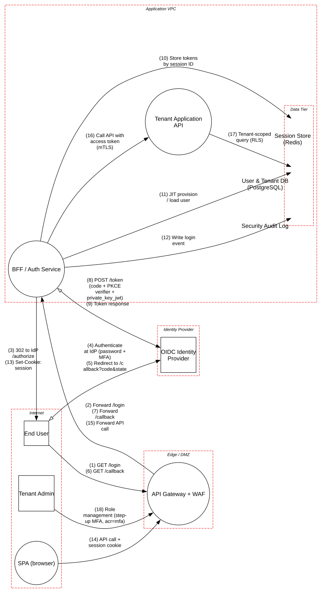

# SaaS Login with OAuth 2.0 / OIDC

> Multi-tenant SaaS login through an external OIDC identity provider, using a Backend-for-Frontend so the browser never holds tokens.

**Tier:** Traditional · **Standards:** OAuth 2.0 Security BCP (RFC 9700), OIDC Core 1.0, OWASP ASVS 5.0 V6–V10, NIST SP 800-63B

## System Overview & Context

A B2B SaaS product lets employees of customer organizations (tenants) sign in with their company identity provider. Each tenant configures its own IdP connection (Okta, Entra ID, Google Workspace) and policy, such as enforced MFA. The application has to:

- Authenticate users without ever seeing their passwords.
- Map each user to exactly one tenant and role set, using claims it can trust.
- Keep long-lived credentials (refresh tokens) out of the browser, where XSS could steal them.

The design follows the **Backend-for-Frontend (BFF)** pattern from the IETF *OAuth 2.0 for Browser-Based Applications* guidance. The BFF is a **confidential client**: it runs Authorization Code + PKCE, authenticates to the IdP with `private_key_jwt`, and keeps tokens server-side. The browser gets only an opaque `__Host-` session cookie.

## Architecture Highlights

| Component | Boundary | Role | Key controls |
|---|---|---|---|
| End User / SPA | Internet | Untrusted client | CSP with nonces, SRI, `frame-ancestors 'none'`, no tokens in JS |
| OIDC Identity Provider | Third party | Authenticates users, issues signed tokens | Tenant MFA policy, breached-password detection |
| API Gateway + WAF | Edge / DMZ | TLS termination, OWASP CRS, size and rate limits | TLS 1.3, HSTS preload |
| BFF / Auth Service | App VPC | OIDC confidential client, session management | `state` + `nonce` + PKCE (S256), JWKS signature checks, session rotation |
| Tenant Application API | App VPC | Business logic | mTLS from the BFF, access-token audience check, per-request authorization |
| Session Store (Redis) | Data tier | Session ID → encrypted token envelope | TLS, AUTH ACLs, TTL = idle timeout |
| User & Tenant DB (PostgreSQL) | Data tier | Profiles, memberships, roles | Row-level security on `tenant_id`, encrypted at rest |
| Security Audit Log | Data tier | Login, MFA and role-change events | WORM storage |

**Trust boundaries.** There are five: Internet, Identity Provider, Edge, App VPC, and Data Tier (nested inside the VPC). The flows that matter most cross the **Internet ↔ IdP** and **Internet ↔ Edge** boundaries during the redirect dance. That is where an attacker can inject, replay or swap authorization codes.

**Data flow pattern.** Front-channel redirects carry only the authorization request and a one-time code. Tokens move only on the back channel (BFF ↔ IdP) and are stored encrypted in Redis. The API receives an access token whose audience is the API, never the ID token.



## Automated STRIDE Threat Analysis

The model gives each element realistic controls and records an explicit `response` for each finding that the design already handles, so the open findings show the real gaps.

| STRIDE | Key threats (pytm IDs) | Assessment |
|---|---|---|
| **Spoofing** | `AA01`, `AA02`, `AC16`, `AC17`, `CR01`, `CR03` | Gateway and SPA findings are **transferred** to the BFF, which owns sessions; passwords are handled only at the IdP. Session sidejacking (`CR01`) is mitigated by `__Host-`/Secure/HttpOnly cookies, HSTS preload and session rotation on login. |
| **Tampering** | `INP36`, `INP37`, `SC05` | **Open.** The gateway → API hop runs HTTP/1.1 without strict parsing, so request smuggling (desync) can bypass WAF rules. BFF and API images are **not signed**, so a compromised registry or pipeline can ship tampered code. |
| **Repudiation** | `DE04` | **Open.** Audit events include attacker-controlled fields (User-Agent, `login_hint`) with no schema validation, which allows log forging and CRLF injection into downstream SIEM parsers. |
| **Information Disclosure** | `DE03`, `AA03` | Sniffing on public flows is **mitigated** by TLS 1.3 only. Credential exploitation at the gateway is **transferred** to BFF session validation. |
| **Denial of Service** | `DO01`, `DO02` | **Open.** `/callback` and `/token` have no per-account or per-IP throttling beyond the edge, so an attacker can drive the IdP token endpoint at scale. That exhausts the tenant's IdP rate limit and locks every user of that tenant out. |
| **Elevation of Privilege** | `AC01`, `AC12`, `AC13` | **Accepted** on the SPA: the browser is untrusted by design, and every authorization decision is enforced by the BFF and API. |

### Threats beyond the rule engine (manual analysis)

pytm's rules work at the element level and don't know OAuth semantics. These protocol-level threats come from manual review against RFC 9700:

| # | Threat | STRIDE | Status in design |
|---|---|---|---|
| M1 | **Authorization code injection / CSRF on `/callback`.** An attacker's code is bound to the victim's session. | Spoofing | Mitigated: `state` bound to a pre-auth cookie, plus PKCE `code_verifier` |
| M2 | **IdP mix-up.** In multi-IdP tenants, a malicious IdP tricks the client into sending another IdP's code to it. | Spoofing | **Gap**: validate the `iss` response parameter (RFC 9207) and keep per-transaction expected-issuer state |
| M3 | **Tenant takeover via unverified `email` claim** ("nOAuth"). Users are linked by mutable email instead of `iss` + `sub`. | Elevation of Privilege | **Gap**: key identities on `(iss, sub)`; never trust `email` unless `email_verified` holds *and* the domain is verified for that tenant |
| M4 | **Open redirect via `return_to` parameter** after login, used for phishing or token leakage | Spoofing | **Gap**: allow-list relative paths only |
| M5 | **Refresh token theft and replay** from the session store | Information Disclosure | Partially mitigated: tokens are envelope-encrypted; add refresh-token rotation with reuse detection at the IdP |
| M6 | **Session fixation** across the login boundary | Spoofing | Mitigated: session ID rotated after the token exchange |

## Mitigation Strategy & Recommendations

| Priority | Recommendation | Addresses | Mapping |
|---|---|---|---|
| **P1** | Key federated identities on `(iss, sub)`. Reject the `email` claim for account linking unless the domain is verified for that tenant. | M3 | OWASP Top 10 A07, ASVS V6 |
| **P1** | Validate the RFC 9207 `iss` parameter on every authorization response; store the expected issuer with `state`. | M2 | RFC 9700 §4.4 |
| **P1** | Add per-IP and per-tenant rate limits on `/login`, `/callback` and `/token` in the BFF, with circuit breakers toward the IdP. | `DO01`, `DO02` | NIST SP 800-53 SC-5 |
| **P2** | Terminate HTTP/1.1 at the gateway and use HTTP/2 end-to-end to the API. Reject ambiguous `Content-Length`/`Transfer-Encoding`. | `INP36`, `INP37` | OWASP Top 10 A05 |
| **P2** | Sign container images (Sigstore cosign) and enforce verification at deploy. Publish SRI hashes for SPA bundles. | `SC05` | NIST SP 800-218 PS.2, SLSA L3 |
| **P2** | Schema-validate and encode audit events before writing them (structured JSON, CRLF stripped, max field lengths). Hash-chain batches. | `DE04` | NIST SP 800-53 AU-9, AU-10 |
| **P3** | Allow-list post-login redirects (relative paths only). | M4 | OWASP Top 10 A01 |
| **P3** | Enable refresh-token rotation with reuse detection, and bind sessions to device signals for step-up. | M5 | RFC 9700 §4.14 |

**Residual risk.** After P1 and P2, the main remaining exposure is IdP compromise or tenant-admin misconfiguration, such as MFA disabled at the IdP. Read the `amr`/`acr` claims and enforce a minimum assurance level per tenant in the BFF, rather than relying on IdP policy alone.

## Run it

```bash
pip install -r ../../../requirements.txt
python model.py --dfd | dot -Tsvg -o dfd.svg
python model.py --json findings.json
```

<!-- atlas:findings:begin -->
<!-- Generated by tools/atlas.py refresh. Do not edit by hand. -->

### pytm Findings Register

`pytm` evaluated **10 elements** and **18 dataflows** against **135 threat rules** and produced **39 findings**: **7 open** and 32 with a recorded response (mitigated, transferred or accepted, set via `overrides` in `model.py`).

| STRIDE | Open | Responded | Total |
|---|---:|---:|---:|
| Spoofing | 0 | 11 | 11 |
| Tampering | 4 | 4 | 8 |
| Repudiation | 1 | 0 | 1 |
| Information Disclosure | 0 | 10 | 10 |
| Denial of Service | 2 | 0 | 2 |
| Elevation of Privilege | 0 | 7 | 7 |
| **Total** | **7** | **32** | **39** |

#### Open findings

| Threat | Element | STRIDE | Severity |
|---|---|---|---|
| `DE04` Audit Log Manipulation | Security Audit Log | Repudiation | High |
| `INP37` HTTP Request Smuggling | Tenant Application API | Tampering | High |
| `SC05` Removing Important Client Functionality | BFF / Auth Service | Tampering | High |
| `SC05` Removing Important Client Functionality | Tenant Application API | Tampering | High |
| `DO01` Flooding | BFF / Auth Service | Denial of Service | Medium |
| `DO02` Excessive Allocation | BFF / Auth Service | Denial of Service | Medium |
| `INP36` HTTP Response Smuggling | Tenant Application API | Tampering | Medium |

<details>
<summary>Findings with a recorded response (32)</summary>

| Threat | Element | Severity | Status | Rationale |
|---|---|---|---|---|
| `AC06` Using Malicious Files | API Gateway + WAF | Very High | Mitigated | no file upload endpoints; WAF blocks multipart bodies on auth routes |
| `AC17` Session Hijacking - ServerSide | API Gateway + WAF | Very High | Transferred | server-side sessions live in the BFF and are rotated on login |
| `AA03` Exploitation of Trusted Credentials | API Gateway + WAF | High | Transferred | session validation happens in the BFF; gateway only forwards |
| `AA04` Exploiting Trust in Client | API Gateway + WAF | High | Transferred | server-side validation is performed by the BFF and API |
| `AC12` Privilege Escalation | SPA (browser) | High | Accepted | the browser is untrusted; all authentication and authorization is enforced server-side |
| `AC16` Session Credential Falsification through Prediction | API Gateway + WAF | High | Transferred | session identifiers are 256-bit CSPRNG values issued by the BFF |
| `CR01` Session Sidejacking | BFF / Auth Service | High | Mitigated | cookie is __Host- prefixed, Secure, HttpOnly, SameSite=Lax; TLS 1.3 + HSTS preload; session ID rotated on login |
| `CR03` Dictionary-based Password Attack | API Gateway + WAF | High | Transferred | passwords are verified only by the IdP (breached-password checks, lockout, MFA) |
| `CR03` Dictionary-based Password Attack | SPA (browser) | High | Transferred | the SPA never handles passwords; credentials are entered only at the IdP |
| `SC03` Embedding Scripts within Scripts | API Gateway + WAF | High | Transferred | authorization is enforced downstream; WAF managed rules filter script payloads |
| `SC05` Removing Important Client Functionality | API Gateway + WAF | High | Accepted | managed service; client integrity is covered by SRI + CSP on the SPA |
| `AA01` Authentication Abuse/ByPass | API Gateway + WAF | Medium | Transferred | authentication is enforced by the BFF on every route except /login and /callback |
| `AA01` Authentication Abuse/ByPass | SPA (browser) | Medium | Accepted | the browser is untrusted; all authentication and authorization is enforced server-side |
| `AA02` Principal Spoof | API Gateway + WAF | Medium | Transferred | principal is established by the BFF from the IdP-signed ID token |
| `AA02` Principal Spoof | SPA (browser) | Medium | Accepted | the browser is untrusted; all authentication and authorization is enforced server-side |
| `AC01` Privilege Abuse | API Gateway + WAF | Medium | Transferred | privileges are evaluated by the BFF and API |
| `AC01` Privilege Abuse | SPA (browser) | Medium | Accepted | the browser is untrusted; all authentication and authorization is enforced server-side |
| `AC07` Exploiting Incorrectly Configured Access Control Security Levels | API Gateway + WAF | Medium | Transferred | route-level authorization lives in the BFF and API |
| `AC08` Manipulate Registry Information | API Gateway + WAF | Medium | Accepted | managed gateway, no host registry exposed |
| `AC09` Functionality Misuse | API Gateway + WAF | Medium | Transferred | business-logic authorization lives in the API |
| `AC11` Session Credential Falsification through Manipulation | API Gateway + WAF | Medium | Transferred | session identifiers are issued and verified by the BFF |
| `AC13` Hijacking a privileged process | SPA (browser) | Medium | Accepted | the browser is untrusted; all authentication and authorization is enforced server-side |
| `DE03` Sniffing Attacks | 302 to IdP /authorize | Medium | Mitigated | TLS 1.3 only, HSTS preload; a VPN is not applicable to public clients |
| `DE03` Sniffing Attacks | API call + session cookie | Medium | Mitigated | TLS 1.3 only, HSTS preload; a VPN is not applicable to public clients |
| `DE03` Sniffing Attacks | Authenticate at IdP (password + MFA) | Medium | Mitigated | TLS 1.3 only, HSTS preload; a VPN is not applicable to public clients |
| `DE03` Sniffing Attacks | GET /callback | Medium | Mitigated | TLS 1.3 only, HSTS preload; a VPN is not applicable to public clients |
| `DE03` Sniffing Attacks | GET /login | Medium | Mitigated | TLS 1.3 only, HSTS preload; a VPN is not applicable to public clients |
| `DE03` Sniffing Attacks | POST /token (code + PKCE verifier + private_key_jwt) | Medium | Mitigated | TLS 1.3 only, HSTS preload; a VPN is not applicable to public clients |
| `DE03` Sniffing Attacks | Redirect to /callback?code&state | Medium | Mitigated | TLS 1.3 only, HSTS preload; a VPN is not applicable to public clients |
| `DE03` Sniffing Attacks | Role management (step-up MFA, acr=mfa) | Medium | Mitigated | TLS 1.3 only, HSTS preload; a VPN is not applicable to public clients |
| `DE03` Sniffing Attacks | Set-Cookie: session | Medium | Mitigated | TLS 1.3 only, HSTS preload; a VPN is not applicable to public clients |
| `DE03` Sniffing Attacks | Token response | Medium | Mitigated | TLS 1.3 only, HSTS preload; a VPN is not applicable to public clients |

</details>

<!-- atlas:findings:end -->
